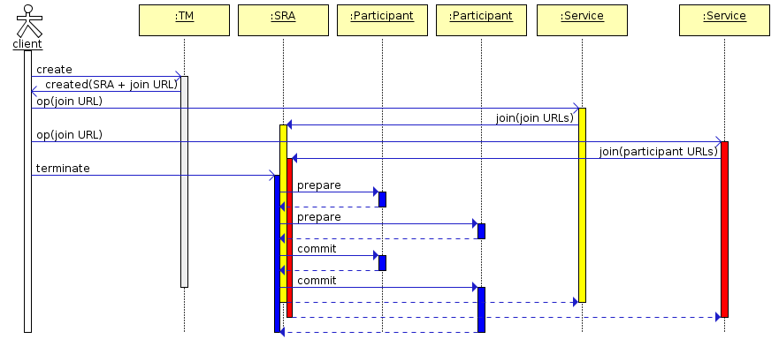
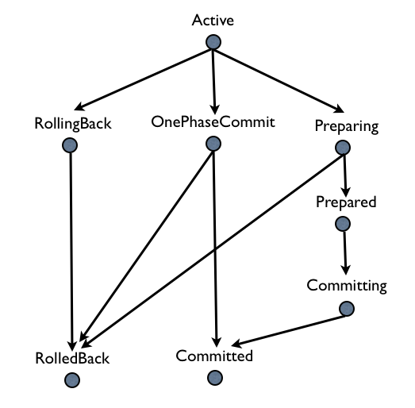

Table of Contents

  - [Long Running Actions](#long-running-actions)
    - [Introduction](#introduction)
    - [Motivation](#motivation)
    - [Proposed solution](#proposed-solution)
      - [The Model](#the-model)
      - [CDI Annotations for LRAs](#cdi-annotations-for-lras)
        - [Java Annotations](#java-annotations)
          - [Controlling the lifecycle of an LRA](#controlling-the-lifecycle-of-an-lra)
          - [Compensating Activities](#compensating-activities)
          - [Nesting LRAs](#nesting-lras)
          - [Timing out LRAs and Compensators](#timing-out-lras-and-compensators)
          - [Leaving an LRA](#leaving-an-lra)
          - [Reporting the status of a participant](#reporting-the-status-of-a-participant)
          - [Forgetting an LRA](#forgetting-an-lra)
        - [Injecting an LRA Client API](#injecting-an-lra-client-api)
        - [Java based LRA participant registration API](#java-based-lra-participant-registration-api)
      - [Interoperability with other languages](#interoperability-with-other-languages)
        - [Protocol URLs](#protocol-urls)
          - [LRA Coordinator URL](#lra-coordinator-url)
          - [The LRA URL](#the-lra-url)
          - [Participants](#participants)
  - [Short Running Actions](#short-running-actions)
    - [Architecture](#architecture)
    - [State Transitions](#state-transitions)
    - [Transaction Context Propagation](#transaction-context-propagation)
    - [CDI Annotations for SRAs](#cdi-annotations-for-sras)
      - [SRA Lifecycle Support](#sra-lifecycle-support)
      - [SRA Participant Support](#sra-participant-support)
        - [Rollback](#rollback)
        - [Commit](#commit)
        - [OnePhaseCommit](#onephasecommit)
        - [Prepare](#prepare)
        - [Status](#status)
      - [Timing out SRAs and Participants](#timing-out-sras-and-participants)
        - [TimeLimit](#timelimit)
      - [Java based SRA participant registration API](#java-based-sra-participant-registration-api)
  - [Relationship Between SRAs and LRAs](#relationship-between-sras-and-lras)
  - [Appendix 1](#appendix-1)
    - [Typical Recovery Scenarios](#typical-recovery-scenarios)

# Consistency Models for Microservices
# Long Running Actions

* Proposal: [MP-0009](0009-LRA.md)
* Authors: [Michael Musgrove](https://github.com/mmusgrov/),
    [Nicola Ferraro](https://github.com/nicolaferraro),
    [Ondra Chaloupka](https://github.com/ochaloup),
    [Tom Jenkinson](https://github.com/tomjenkinson)
    and others
* Status: **Sandbox**
* Decision Notes: [Discussion thread topic covering the
Rationale](https://groups.google.com/forum/#!searchin/microprofile/transactions%7Csort:relevance/microprofile/CJirjFkM9Do/TrApz-fBDQAJ)
* [LRA Reference Implementation](https://github.com/jbosstm/narayana/tree/master/rts/lra)
* [SRA Reference Implementation](https://github.com/jbosstm/narayana/tree/master/rts/sra)

## Introduction

The proposal introduces APIs for services to coordinate activities.

The main thrust of the proposal introduces an API for loosely coupled
services to coordinate long running activities in such a way as to guarantee
a globally consistent outcome without the need to take locks on data.

A secondary aim of the proposal is to introduce an API for services to
coordinate short running activities in such a way as to guarantee
a globally consistent outcome but this time with the possibility that
it may be necessary to lock data. The goal of this part of the specification
is to facilitate the developer in writing the individual steps involved in a
long running activity.

The APIs are framed in terms of Java CDI annotations that should be applied
to JAX-RS resources. However, the proposal is also described in terms of
REST resources which means that services written in other languages can
also coordinate with CDI annotated JAX-RS resources. And for services that
do not communicate via HTTP we also define a pure java based registration API.

It is expected that different implementations of this specification will need
to interoperate and implementers should pay special attention
[to the section on interoperability](interoperability-with-other-languages)
to achieve this goal.

## Motivation

In a loosely coupled service based environment there is sometimes a need for
different services to provide consistency guarantees. Typical examples include:

* order processing involving three services (take order, bill customer,
  ship product). If the shipping service finds that it is out of stock then
  the customer will have been billed with no prospect of receiving his item;
* an airline overbooks a flight which means that the booking count and the
  flight capacity are inconsistent.

There are various ways that systems overcome such inconsistency but it would be
advantageous to provide a generic solution which handles failure conditions,
maintains state for those flows that span long periods of time and ensures
that correcting activities are called correctly.

Traditional techniques for guaranteeing consistency in distributed environments
has focused on XA transactions where locks may be held for long periods thereby
introducing strong coupling between services and decreasing concurrency to
unacceptable levels. Additionally, if such a transaction aborts then valuable
work which may be valid will be rolled back. In view of these issues an
alternative approach is desirable.

Goals

- support long running actions
- no strong coupling between services
- allow actions to finish early
- allow compensating actions if a business activity is cancelled
- support short running actions that may need to be started to
  facilitate the execution of a step in a long running action

## Proposed solution

We propose a compensation based approach in which participants
make changes visible but register a compensatory action
which is performed if something goes wrong. We call the model LRA
(short for Long Running Action) and is based on work done within
the [OASIS Web Services Composite Application Framework Technical
Committee](https://www.oasis-open.org/committees/tc_home.php?wg_abbrev=ws-caf):
[Long Running Action transaction
model](https://www.oasis-open.org/committees/document.php?document_id=12794)
but updated to be more suited for use in microservice based architectures.

Within the LRA model, an activity reflects business interactions:
all work performed within the scope of an activity is required to be
compensatable. Therefore, an activity’s work is either performed successfully
or undone. How services perform their work and ensure it can be undone if
compensation is required are implementation choices and is not exposed to the
LRA model which simply defines the triggers for compensation actions and the
conditions under which those triggers are executed. In other words, an LRA
coordinator is concerned only with ensuring participants obey the protocol
necessary to make an activity compensatable (and the semantics of the business
interactions are not part of the model). Issues such as isolation of services
between potentially conflicting activities and durability of service work
are assumed to be implementation decisions. The coordination protocol used to
ensure an activity is completed successfully or compensated is not two-phase
and is intended to better model interactions between microservices. Although
this may result in non-atomic behaviour for the overall business activity,
other activities may be started by the service to attempt to compensate in
some other manner.

In the model, an LRA is tied to the scope of an activity so that when the
activity terminates the LRA coordination protocol will be automatically
performed either to accept or to compensate the work. For example, when a
user reserves a seat on a flight, the airline reservation centre may take an
optimistic approach and actually book the seat and debit the user's account,
relying on the fact that most of their customers who reserve seats later
book them; the compensation action for this activity would be to un-book
the seat and credit the user’s account.

As in any business interaction, service activities may or may not be
compensatable. Even the ability to compensate may be a transient capability
of a service. A Compensator (or simply LRA participant) is the LRA participant
that operates on behalf of a service to undo the work it performs within the
scope of an LRA or to compensate for the fact that the original work could not
be completed.

### The Model

The model concerns participants and a coordinator. A client starts a new
LRA via a call to an LRA coordination service. This call creates a new LRA coordinator.
When a business service does work that may have to be later compensated
for within the scope of the LRA, it enlists a participant with the LRA
coordinator. Subsequently the client closes or cancels the LRA via the
coordinator which in turn tells all enlisted participants to either
complete or compensate:


The lifecycle of an LRA

The LRA participant will be invoked in the following way by the LRA
coordinator when the activity terminates:

* Success: the activity has completed successfully. If the activity is
  nested then participants may propagate themselves to the enclosing LRA.
  Otherwise the participants are informed that the activity has terminated
  and they can perform any necessary cleanups.
* Fail: the activity has completed unsuccessfully. All participants that
  are registered with the LRA will be invoked to perform compensation in
  the reverse order. The coordinator forgets about all participants that
  indicated they operated correctly. Otherwise, compensation may be
  attempted again (possibly after a period of time) or alternatively a
  compensation violation has occurred and must be logged. Each service is
  required to log sufficient information in order to ensure (with best
  effort) that compensation is possible. Each participant or subordinate
  coordinator (in the case of nested LRAs) is responsible for ensuring
  that sufficient data is made durable in order to undo the LRA in the
  event of failures. Interposition and check pointing of state allow the
  system to drive a consistent view of the outcome and recovery actions taken,
  but allowing always the possibility that recovery isn’t possible and must
  be logged or flagged for the administrator. In a large scale environment
  or in the presence of long term failures recovery may not be automatic and
  manual intervention may be necessary to restore an application’s consistency.
  Note that calling participants in reverse order does not guarantee that
  the compensation actions will be performed in strict sequential
  order since participants are allowed to indicate that the compensation
  is in progress and will complete at some future time. Furthermore a
  participant can indicate that it failed to compensate, or could be unavailable
  in which case it will be periodically retried (out of order).

Participants follow a state model:
<a name="participant-state-model"></a>

   - `Compensating`: a participant is currently compensating for the work
      it did during the LRA;
   - `Compensated`: a participant has successfully compensated for the LRA.
   - `FailedToCompensate`: the participant was not able to compensate for
      the LRA. It must maintain information about the work it was to
      compensate until the coordinator sends it a forget message.
   - `Completing`: the participant is tidying up after being told to complete.
   - `Completed`: the participant has confirmed that it has finished tidying up.
   - `FailedToComplete`: the participant was unable to tidy-up.

The LRA follows a similar state model:
<a name="LRA-state-model"></a>

   - `Compensating`: the LRA is currently being cancelled
   - `Compensated`: the LRA has successfully cancelled
   - `FailedToCompensate`: one or more participants was not able to compensate
   - `Completing`: the LRA is currently being closed
   - `Completed`: the LRA has closed
   - `FailedToComplete`: one or more participants was not able to complete

Different usage patterns for LRAs are possible, for example LRAs may
be used sequentially and concurrently, where the termination of one LRA
signals the start of some other unit of work within an application. However,
LRAs are units of compensatable work and an application may have as many
such units of work operating simultaneously as it needs to accomplish its
tasks. Furthermore, the outcome of work within LRAs may determine how other
LRAs are terminated. An application can be structured so that LRAs are
used to assemble units of compensatable work and then held in the active
state while the application performs other work in the scope of different
(concurrent or sequential) LRAs. Only when the right subset of work (LRAs)
is arrived at by the application will that subset be confirmed; all other
LRAs will be told to cancel (complete in a failure state).

In the rest of this proposal we specify three different APIs for controlling
the lifecycle of and participation in LRAs and a fourth API for writing participants:

   1. [CDI Annotations for LRAs](#cdi-annotations-for-lras)
   2. [Client API](lra-annotations/src/main/java/org/eclipse/microprofile/lra/client/LRAClientAPI.java)
   3. [REST based description of various resources](#Interoperability-with-other-languages)
   4. [Java based LRA participant registration API](#java-based-lra-participant-registration-api)

This set of APIs means that the specification will be useable in a wide variety of systems:

   - CDI is the API of choice for MicroProfile;
   - the client API is for use with containers that do not provide CDI;
   - the REST based description is for clients and services written in other languages
     and it serves as the interoperability protocol for different implementations of
     this specification;
   - the participant registration API is for those services that do not listen
     on HTTP endpoints

### CDI Annotations for LRAs

Support for the proposal in MicroProfile is primarily based upon
the use of CDI annotations for controlling the lifecycle of LRAs
and participants.

#### Java Annotations

A JAX-RS implementation of the specification should be achievable via a set
of CDI annotations which are available in the
[linked java package](lra-annotations/src/main/java/org/eclipse/microprofile/lra/annotation).
The service developer annotates resources to specify how LRAs should be controlled
and when to *enlist a class* as a participant:

##### Controlling the lifecycle of an LRA

```java
/**
 * An annotation for controlling the lifecycle of Long Running Actions (LRAs).
 *
 * Newly created LRAs are uniquely identified and the id is referred to as the LRA context. The context is passed around
 * using a JAX-RS request/response header called LRAClient#LRA_HTTP_HEADER ("Long-Running-Action"). The implementation (of the LRA
 * specification) is expected to manage this context and the application developer is expected to declaratively control
 * the creation, propagation and destruction of LRAs using the @LRA annotation. When a JAX-RS bean method is invoked in the
 * context of an LRA any JAX-RS client requests that it performs will carry the same header so that the receiving
 * resource knows that it is inside an LRA context (typically achieved using JAX-RS client filters).
 *
 * Resource methods can access the context id, if required, by injecting it via the JAX-RS @HeaderParam annotation.
 * This may be useful, for example, for associating business work with an LRA.
 */
@Inherited
@InterceptorBinding
@Retention(value = RetentionPolicy.RUNTIME)
@Target({ElementType.TYPE, ElementType.METHOD})
public @interface LRA {

    /**
     * The Type element of the LRA annotation indicates whether a bean method
     * is to be executed within a compensatable LRA context.
     */
    Type value() default Type.REQUIRED;

    /**
     * The Type element of the annotation indicates whether a bean method is to be executed within a
     * compensatable transaction (aka LRA) context where the values provide the following behavior:
     */
    enum Type {
        /**
         *  If called outside an LRA context a JAX-RS filter will begin a new LRA for the duration of the
         *  method call and when the call completes another JAX-RS filter will complete the LRA.
         */
        REQUIRED,

        /**
         *  If called outside an LRA context a JAX-RS filter will begin a new LRA for the duration of the
         *  method call and when the call completes another JAX-RS filter will complete the LRA.
         *
         *  If called inside an LRA context a JAX-RS filter will suspend it and begin a new LRA for the
         *  duration of the method call and when the call completes another JAX-RS filter will complete the
         *  LRA and resume the one that was active on entry to the method.
         */
        REQUIRES_NEW,

        /**
         *  If called outside a transaction context, the method call will return
         *  with a 412 Precondition Failed HTTP status code
         *  
         *  If called inside a transaction context the bean method execution will then continue within
         *  that context.
         */
        MANDATORY,

        /**
         *  If called outside an LRA context the bean method execution
         *  must then continue outside an LRA context.
         *  
         *  If called inside an LRA context the managed bean method execution
         *  must then continue inside this LRA context.
         */
        SUPPORTS,

        /**
         *  The bean method is executed without an LRA context. If a context is present on
         *  entry then it is suspended and then resumed after the execution has completed.
         */
        NOT_SUPPORTED,

        /**
         *  If called outside an LRA context the managed bean method execution
         *  must then continue outside an LRA context.
         *  
         *  If called inside an LRA context the method is not executed and a
         *  412 Precondition Failed HTTP status code is returned to the caller.
         */
        NEVER
    }

    /**
     * Some annotations (such as REQUIRES_NEW) will start an LRA on entry to a method and
     * end it on exit. For some business activities it is desirable for the action to survive
     * method execution and be completed elsewhere.
     *
     * @return whether or not newly created LRAs will survive after the method has finished executing.
     */
    boolean delayClose() default false;

    /**
     * Normally if an LRA is present when a bean method is executed it will not be ended when
     * the method returns. To override this behaviour and force LRA termination on exit use the
     * terminal element
     *
     * @return true if an LRA that was present before method execution will be terminated when the bean method finishes.
     */
    boolean terminal() default false;

    /**
     * If true then the annotated class will be checked for participant annotations and when present the class
     * will be enlisted with any LRA that is associated with the invocation
     *
     * @return whether or not to automatically enlist a participant
     */
    boolean join() default true;

    /**
     * The cancelOnFamily element can be set to indicate which families of HTTP response codes will cause
     * the LRA to cancel. By default client errors (4xx codes) and server errors (5xx codes) will result in
     * cancellation of the LRA.
     *
     * @return the {@link Response.Status.Family} families that will cause cancellation of the LRA
     */
    @Nonbinding
    Response.Status.Family[] cancelOnFamily() default {};

    /**
     * The cancelOn element can be set to indicate which  HTTP response codes will cause the LRA to cancel
     *
     * @return the {@link Response.Status} HTTP status codes that will cause cancellation of the LRA
     */
    @Nonbinding
    Response.Status [] cancelOn() default {};
```

When an LRA is present it SHOULD be made available to the business logic
via request and response headers (with the name "Long-Running-Action")

Example:

```java
  @POST
  @Path("/book")
  @Produces(MediaType.APPLICATION_JSON)
  @LRA(value = LRA.Type.REQUIRED,
       cancelOn = {Response.Status.INTERNAL_SERVER_ERROR} // cancel on a 500 code
       cancelOnFamily = {Response.Status.Family.CLIENT_ERROR}, // cancel on any 4xx code
       delayClose = true) // the LRA will continue to run when the method finishes
  public Response bookTrip(...) { ... }

  @PUT
  @Path("/confirm")
  @Produces(MediaType.APPLICATION_JSON)
  @Consumes(MediaType.APPLICATION_JSON)
  @LRA(LRA.Type.SUPPORTS,
       terminal = true) // the confirmation should trigger the closing of the LRA started in the bookTrip bean method
  public Booking confirmTrip(Booking booking) throws BookingException { ... }
```

##### Compensating Activities

Participants join LRAs using the `@Compensate` and `@Complete`
annotations. These annotations must be combined with JAX-RS annotations so
that they can be invoked as JAX-RS endpoints. Only the `@Compensate` method
is mandatory.

If a JAX-RS resource method is invoked in the context of an LRA and the resource
class contains a method annotated with `@Compensate` then the class will be enlisted
as a participant of the LRA. When the LRA is cancelled this `@Compensate` will
be invoked with a header parameter that contains the id of the LRA, for example:

```java
  @PUT
  @Path("/compensate")
  @Produces(MediaType.APPLICATION_JSON)
  @Compensate
  public Response compensateWork(@HeaderParam(LRA_HTTP_HEADER) String lraId) {
    // compensate for whatever activity the business logic has associated with lraId
  }
```

Similarly, if the developer has provided a `@Complete` method it will be invoked
if the LRA is closed.

If the bean knows that it will never be able to compensate the activity
it SHOULD return a `200 OK` status code and content body with the literal string
`FailedToCompensate`. If it returns any other content the coordinator will use
the `@Status` method to obtain the status but if the `@Status` method is not present
the condition will be logged and this participant will be dropped by the coordinator
(ie the participant should avoid this circumstance).
Similar remarks apply if the bean method knows that it will never be able to complete.

If the bean cannot perform a compensation or completion activity immediately the
termination method MUST indicate the condition. In this case the LRA coordinator
will need to monitor the progress of the participant and the developer must
provide a `@GET` method annotated with `@Status` which must return a string representation
[string representation of the status](#participant-state-model) of the status.
The bean indicates that it cannot finish immediately by by either

   - returning a `202 Accepted` HTTP status  code or
   - the method is marked as a JAX-RS asynchronous method (using the
     `javax.ws.rs.container.Suspended` annotation). If an implementation
     does not support asynchronous JAX-RS then it MUST return the `202 Accepted`
     code.

When the coordinator knows it has the final status it will inform the participant
that it can clean up. The developer indicates which method to use for this purpose
by annotating one of the methods with the `@DELETE` and `@Forget` annotations. If the
developer has not provided both of these methods then a warning is logged when
the asynchronous termination method finishes. But note that the
[interoperability portion of this specification](interoperability-with-other-languages)
allows the status URL to be reported in the response Location header and this will
be used in place of the `@Status` and `@Forget` methods if present. However, there
is no checking that the URLs are valid so mixing the two APIs is not recommended.

If an annotation is present on multiple methods an arbitrary one is chosen.

##### Nesting LRAs

An activity can be scoped within an existing LRA using the `@NestedLRA`
annotation. Invoking a method marked with this annotation will start a
new LRA whose outcome depends upon whether the enclosing LRA is closed
or cancelled. If the nested LRA is closed but the outer LRA is cancelled
then the participants registered with the nested LRA will be told to
compensate. Note that there is no annotation to directly cancel a closed
nested LRA and the [Java LRAClientAPI](#injecting-an-lra-client-api) must be
used for this purpose if required.

##### Timing out LRAs and Compensators

The ability to compensate may be a transient capability of a service so
participants (and LRAs) can be timed out after which the compensator is
called (or the LRA is cancelled).

To set such a time limit use the `@TimeLimit` annotation, for example:

```java
  @GET
  @Path("/doitASAP")
  @Produces(MediaType.APPLICATION_JSON)
  @TimeLimit(limit = 100, unit = TimeUnit.MILLISECONDS)
  @LRA(value = LRA.Type.REQUIRED)
  public Response theClockIsTicking(@HeaderParam(LRA_HTTP_HEADER) String lraId) {...}
```

##### Leaving an LRA

If a bean method annotated with `@Leave` is executed in the context of a
LRA then if the bean class has registered a participant with the active
LRA it will be removed from the LRA just before the bean method is called
(and will not be asked to complete or compensate when the LRA is
subsequently ended).

##### Reporting the status of a participant

As alluded to above, participants can provide a method for reporting the
status of the participant by annotating one of the methods with the `@Status`
annotation. The method is required when at least one the participant methods
that is annotated with `@Compensate` or `@Complete` is not able to complete the
task synchronously. If the participant has not yet been asked to `@Compensate`
or Complete it should report the error using a JAX-RS exception mapper that
maps to a `412 Precondition Failed` HTTP status code (such as
IllegalLRAStateException or InvalidStateException). Otherwise the response
entity must correspond to one of the following enum values (as reported by
the enum name() method):

```java
/**
 * The status of a participant. The status is only valid after the coordinator has told the participant to
 * complete or compensate. The name value of the enum should be returned by any method marked with
 * the {@link Status} annotation.
 */
public enum CompensatorStatus {
    Compensating, // the Compensator is currently compensating for the LRA.
    Compensated, //  the Compensator has successfully compensated for the LRA.
    FailedToCompensate, //  the Compensator was not able to compensate for the LRA
                // (and must remember it could not compensate until it receives a forget message).
    Completing, //  the Compensator is tidying up after being told to complete.
    Completed, //  the Compensator has confirmed.
    FailedToComplete, //  the Compensator was unable to tidy-up.
}
```

Notice that the enum constants correspond to
[participant state model](#participant-state-model).

##### Forgetting an LRA

If a participant is unable to compete or compensate immediately then it must
remember the fact until explicitly told that it can clean up using
the `@Forget` annotation.

#### Injecting an LRA Client API

For completeness the proposal supports clients that wish to directly control
LRAs and participants. To support this class of user an instance of [client
API](lra-annotations/src/main/java/org/eclipse/microprofile/lra/client/LRAClientAPI.java)
can be injected:

``` java
public interface LRAClientAPI {

    /**
     * Start a new LRA
     *
     * @param parentLRA The parent of the LRA that is about to start. If null then the new LRA will
     *                  be top level
     * @param clientID The client may provide a (preferably) unique identity which will be reported
     *                back when the LRA is queried.
     * @param timeout Specifies the maximum time that the LRA will exist for. If the LRA is
     *                terminated because of a timeout it will be cancelled.
     * @param unit Specifies the unit that the timeout is measured in
     *
     * @throws GenericLRAException a new LRA could not be started. The specific reason
     *                is available in {@link GenericLRAException#getStatusCode()}
     */
    URL startLRA(URL parentLRA, String clientID, Long timeout, TimeUnit unit) throws GenericLRAException;

    /**
     * Attempt to cancel an LRA
     *
     * Trigger compensation of all participants enlisted with the LRA (ie the compensate message will be
     * sent to each participant).
     *
     * @param lraId The unique identifier of the LRA (required)
     * @return the response MAY contain the final status of the LRA as reported by
     * {@link CompensatorStatus#name()}. If the final status is not returned the client can still discover
     * the final state using the {@link LRAClientAPI#getStatus(URL)} method
     * @throws GenericLRAException Communication error (the reason is available via the
     * {@link GenericLRAException#getStatusCode()} method
     */
    String cancelLRA(URL lraId) throws GenericLRAException;

    /**
     * Attempt to close an LRA
     *
     * Tells the LRA to close normally. All participants will be triggered by the coordinator
     * (ie the complete message will be sent to each participant).
     *
     * @param lraId The unique identifier of the LRA (required)
     *
     * @return the response MAY contain the final status of the LRA as reported by
     * {@link CompensatorStatus#name()}. If the final status is not returned the client can still discover
     * the final state using the {@link LRAClientAPI#getStatus(URL)} method
     * @throws GenericLRAException Communication error (the reason is available via the
     * {@link GenericLRAException#getStatusCode()} method
     */
    String closeLRA(URL lraId) throws GenericLRAException;

    /**
     * Lookup active LRAs
     *
     * @throws GenericLRAException on error
     */
    List<LRAStatus> getActiveLRAs() throws GenericLRAException;

    /**
     * Returns all LRAs
     *
     * Gets both active and recovering LRAs
     *
     * @return List<LRA>
     * @throws GenericLRAException on error
     */
    List<LRAStatus> getAllLRAs() throws GenericLRAException;

    /**
     * List recovering Long Running Actions
     *
     * Returns LRAs that are recovering (ie the participant is still
     * attempting to complete or compensate
     *
     *
     * @throws GenericLRAException on error
     */
    List<LRAStatus> getRecoveringLRAs() throws GenericLRAException;

    /**
     * Lookup the status of an LRA
     *
     * @param lraId the LRA whose status is being requested
     * @return the status or null if the the LRA is still active (ie has not yet been closed or cancelled)
     * @throws GenericLRAException if the request to the coordinator failed.
     * {@link GenericLRAException#getCause()} and/or {@link GenericLRAException#getStatusCode()}
     * may provide a more specific reason.
     */
    Optional<CompensatorStatus> getStatus(URL lraId) throws GenericLRAException;

    /**
     * Indicates whether an LRA is active. The same information can be obtained via a call to
     * {@link LRAClientAPI#getStatus(URL)}.
     *
     * @param lraId The unique identifier of the LRA (required)
     * @throws GenericLRAException if the request to the coordinator failed.
     * {@link GenericLRAException#getCause()} and/or {@link GenericLRAException#getStatusCode()}
     * may provide a more specific reason.
     */
    Boolean isActiveLRA(URL lraId) throws GenericLRAException;

    /**
     * Indicates whether an LRA was compensated. The same information can be obtained via a call to
     * {@link LRAClientAPI#getStatus(URL)}.
     *
     * @param lraId The unique identifier of the LRA (required)
     * @throws GenericLRAException if the request to the coordinator failed.
     * {@link GenericLRAException#getCause()} and/or {@link GenericLRAException#getStatusCode()}
     * may provide a more specific reason.
     */
    Boolean isCompensatedLRA(URL lraId) throws GenericLRAException;

    /**
     * Indicates whether an LRA is complete. The same information can be obtained via a call to
     * {@link LRAClientAPI#getStatus(URL)}.
     *
     * @param lraId The unique identifier of the LRA (required)
     * @throws GenericLRAException if the request to the coordinator failed.
     * {@link GenericLRAException#getCause()} and/or {@link GenericLRAException#getStatusCode()}
     * may provide a more specific reason.     */
    Boolean isCompletedLRA(URL lraId) throws GenericLRAException;

    /**
     * A participant can join with the LRA at any time prior to the completion of an activity.
     * The participant provides end points on which it will listen for LRA related events.
     *
     * @param lraId   The unique identifier of the LRA (required) to enlist with
     * @param timelimit The time limit (in seconds) that the participant can guarantee that it
     *                can compensate the work performed while the LRA is active.
     * @param body   The resource path or participant URL that the LRA coordinator will use
     *               to drive the participant. The coordinator uses the URL as follows:
     *
     *               - `{participant URL}/complete` is the `completion URL`,
     *               - `{participant URL}/compensate` is the `compensation URL` and
     *               - `{participant URL}` serves as both the `status` and `forget` URLs.
     *
     * @param compensatorData data that will be stored with the coordinator and passed back to
     *                        the participant when the LRA is closed or cancelled
     * @return a recovery URL for this enlistment
     *
     * @throws GenericLRAException  if the request to the coordinator failed.
     * {@link GenericLRAException#getCause()} and/or {@link GenericLRAException#getStatusCode()}
     * may provide a more specific reason.
     */
    String joinLRA(URL lraId, Long timelimit, String body, String compensatorData) throws GenericLRAException;

    /**
     * Similar to {@link LRAClientAPI#joinLRA(URL, Long, String, String)} except that the various
     * participant URLs are passed in explicitly.
     */
    String joinLRA(URL lraId, Long timelimit,
                   URL compensateUrl, URL completeUrl, URL forgetUrl, URL leaveUrl, URL statusUrl,
                   String compensatorData) throws GenericLRAException;

    /**
     * Join an LRA passing in a class that will act as the participant.
     * Similar to {@link LRAClientAPI#joinLRA(URL, Long, String, String)} but the various participant URLs
     * are expressed as CDI annotations on the passed in resource class.
     *
     * @param lraId The unique identifier of the LRA (required)
     * @param resourceClass An annotated class for the participant methods: {@link io.narayana.lra.annotation.Compensate},
     *                      etc.
     * @param baseUri Base uri for the participant endpoints
     * @param compensatorData Compensator specific data that the coordinator will pass to the participant when the LRA
     *                        is closed or cancelled
     * @return a recovery URL for this enlistment
     * @throws GenericLRAException if the request to the coordinator failed.
     * {@link GenericLRAException#getCause()} and/or {@link GenericLRAException#getStatusCode()}
     * may provide a more specific reason.
     */
    String joinLRA(URL lraId, Class<?> resourceClass, URI baseUri, String compensatorData) throws GenericLRAException;

    /**
     * Change the endpoints that a participant can be contacted on.
     *
     * @param recoveryUrl the recovery URL returned from a participant join request
     * @param compensateUrl the URL to invoke when the LRA is cancelled
     * @param completeUrl the URL to invoke when the LRA is closed
     * @param statusUrl if a participant cannot finish immediately then it provides
     *                  this URL that the coordinator uses to monitor the progress
     * @param forgetUrl used to inform the participant that can forget about this LRA
     * @param compensatorData opaque data that returned to the participant when the LRA
     *                        is closed or cancelled
     * @return an updated recovery URL for this participant
     * @throws GenericLRAException if the request to the coordinator failed.
     * {@link GenericLRAException#getCause()} and/or {@link GenericLRAException#getStatusCode()}
     * may provide a more specific reason.
     */
    URL updateCompensator(URL recoveryUrl,URL compensateUrl, URL completeUrl, URL forgetUrl, URL statusUrl,
                           String compensatorData) throws GenericLRAException;

    /**
     * A Compensator can resign from the LRA at any time prior to the completion of an activity
     *
     * @param lraId The unique identifier of the LRA (required)
     * @param body  (optional)
     * @throws GenericLRAException if the request to the coordinator failed.
     * {@link GenericLRAException#getCause()} and/or {@link GenericLRAException#getStatusCode()}
     * may provide a more specific reason.
     */
    void leaveLRA(URL lraId, String body) throws GenericLRAException;

    /**
     * LRAs can be created with timeouts after which they are cancelled. Use this method to update the timeout.
     *
     * @param lraId the id of the lra to update
     * @param limit the new timeout period
     * @param unit the time unit for limit
     */
    void renewTimeLimit(URL lraId, long limit, TimeUnit unit);

    /**
     * checks whether there is an LRA associated with the calling thread
     *
     * @return the current LRA (can be null)
     */
    URL getCurrent();

    /**
     * Update the clients notion of the current coordinator.
     *
     * @param lraId the id of the LRA (can be null)
     */
    void setCurrentLRA(URL lraId);
}

```

#### Java based LRA participant registration API

For those applications that cannot directly expose JAX-RS endpoints for
compensation activities this specification optionally supports an API
for directly registering participants. A participant is a java class
that is interested in LRA lifecycle notifications, and does so by registering
an instance of `LRAParticipant` with an instance of an `LRAManagement`:

``` java
/**
 * The API for notifying participants that an LRA is completing or cancelling.
 * A participant joins with an LRA via a call to
 * {@link LRAManagement#joinLRA(LRAParticipant, LRAParticipantDeserializer, URL, Long, TimeUnit)}
 */
public interface LRAParticipant extends Serializable {
    /**
     * Notifies the participant that the LRA is closing
     * @param lraId the LRA that is closing
     * @return null if the participant completed successfully. If the participant cannot
     *         complete immediately it should return a future that the caller can use
     *         to monitor progress. If the JVM crashes before the participant can finish
     *         it should expect this method to be called again. If the participant fails
     *         to complete it must cancel the future or throw a TerminationException.
     * @throws NotFoundException the participant does not know about this LRA
     * @throws TerminationException the participant was unable to complete and will never
     *         be able to do so
     */
    Future<Void> completeWork(URL lraId) throws NotFoundException, TerminationException;

    /**
     * Notifies the participant that the LRA is cancelling
     * @param lraId the LRA that is closing
     * @return null if the participant completed successfully. If the participant cannot
     *         complete immediately it should return a future that the caller can use
     *         to monitor progress. If the JVM crashes before the participant can finish
     *         it should expect this method to be called again. If the participant fails
     *         to complete it must cancel the future or throw a TerminationException.
     * @throws NotFoundException the participant does not know about this LRA
     * @throws TerminationException the participant was unable to complete and will never
     *         be able to do so
     */
    Future<Void> compensateWork(URL lraId) throws NotFoundException, TerminationException;
}

```

where the registration interface is defined as:

``` java
public interface LRAManagement {
    /**
     * Join an existing LRA
     *
     * @param participant an instance of a {@link LRAParticipant} that will be notified when the target LRA ends
     * @param deserializer a mechanism for recreating participants during recovery.
     *                     If the parameter is null then standard Java object deserialization will be used
     * @param lraId the LRA that the join request pertains to
     * @param timeLimit the time for which the participant should remain valid. When this time limit is exceeded
     *                  the participant may longer be able to fulfil the protocol guarantees.
     * @param unit the unit that the timeLimit parameter is expressed in
     */
    String joinLRA(LRAParticipant participant, LRAParticipantDeserializer deserializer,
                   URL lraId, Long timeLimit, TimeUnit unit) throws JoinLRAException;

    /**
     * Join an existing LRA. In contrast to the other form of registration this method does not indicate a time limit
     * for the participant meaning that the participant registration will remain valid until it terminates successfully
     * or unsuccessfully (ie it will never be timed out externally).
     *
     * @param participant an instance of a {@link LRAParticipant} that will be notified when the target LRA ends
     * @param deserializer a mechanism for recreating participants during recovery.
     *                     If the parameter is null then standard Java object deserialization will be used
     * @param lraId the LRA that the join request pertains to
     */
    String joinLRA(LRAParticipant participant, LRAParticipantDeserializer deserializer, URL lraId) throws JoinLRAException;
}
```

How the application obtains an LRAManagement instance is unspecified (for example
the reference implementation does it by CDI injection). The deserializer, if provided,
must match the interface

``` java
/**
 * An object that knows how to recreate a participant from its' persistent form
 */
public interface LRAParticipantDeserializer {
    LRAParticipant deserialize(byte[] recoveryState);
}
```

Compensators must be serializable for this approach to work.

The purpose of the deserializer covers recovery scenarios (where one or more
components fail): the framework must guarantee that participants will still
be triggered (the LRA protocol still provides the "all or nothing" guarantees
that traditional transactions give). The deserializer provides a mechanism
for the recovery component to recreate participants from their persistent
form. Note that, in contrast to the CDI based support, an installation must
ensure that the java class definitions of Compensators must be made available
to the recovery system. Serializable participants need to know how to contact
the original business application in order to trigger compensation activities
whereas the CDI based solution need only persist resource paths which are
likely to correspond to existing microservice endpoints. In other words,
from an administrative and manageability point of view, it is desirable to
use one of the other APIs such as the
[CDI Annotations for LRAs](#cdi-annotations-for-lras).

*In the reference implementation recovery is achieved by depending on an
maven artefact that automatically starts up a proxy participant which
listens for replay requests. For this to work the proxy must start up
on the same endpoint or it must be told where the coordinator resides
so that it can inform the coordinator of its new location: the way in which
participants can report their location is part of the specification and
discussed below in the
[interoperability portion of this specification](#interoperability-with-other-languages).
If a service is restarted the classes for any previously registered compensators
must be on available on the classpath.*

### Interoperability with other languages

To support coordination with services that do not support CDI or JAX-RS there
follows a specification of how to drive the protocol using REST resource URLs:

#### Protocol URLs

##### LRA Coordinator URL

The path or stem of an LRA coordinator URL is `{base uri}/lra-coordinator`
where base-uri is `{protocol}://{hostname}` (such as http://localhost:8080).

   * `GET {base uri}/lra-coordinator` returns all known LRAs
   * `GET {base uri}/lra-coordinator/?status={Completing|Compensated|etc}`
     returns a subset of all LRAs depending upon the
[value of the status query parameter](#participant-state-model)
     If the value is not a valid status then a `400 Bad Request` code
     is returned.
     For example to find all LRAs that are recovering would take two requests:
     -   `GET {base uri}/lra-coordinator/?status=Completing`
     -   `GET {base uri}/lra-coordinator/?status=Compensating`
   * To find all active LRAs (ie ones that have not yet been asked to close
     or cancel specify and empty status:
     -   `GET {base uri}/lra-coordinator/?status=`
   * Performing a `DELETE` on any of the lra-coordinator URLs will return
     a `401 Unauthorized` response code.
   * Performing a `POST` on `{base uri}/lra-coordinator/start` creates an LRA.

##### The LRA URL

Performing a `POST` on `{base uri}/lra-coordinator/start`
will start a new LRA with a default timeout and return an LRA URL that
uniquely identifies the new LRA. An obvious choice for the URL format could
be `{base uri}/lra-coordinator/{LRAId}`). A better alternative would
be to allow the coordinator to return any URL format - ie instead of the
URLs in points 2-6 the coordinator would return a
[link header](https://tools.ietf.org/html/rfc5988) instead.

LRA creation supports two query parameters:

   - `ClientID={ClientID}`
   - `TimeLimit={timeout period in milliseconds}`
   - `ParentLRA={parent LRA URL}`

The client id (which can be any string such as an encoded URL) is
associated with the new LRA and can be retrieved when the LRA is
status is reported.

The `TimeLimit` parameter (in milliseconds) will cause the new LRA to
timeout when the limit is reached unless explicitly closed earlier.
If the LRA is terminated because of a timeout then the LRA will be
cancelled.

The `ParentLRA` query parameter causes the new LRA to be nested
under the parent LRA which means that closing/cancelling the parent
will automatically close/cancel the nested LRA. Closing a nested LRA
is provisional on the parent closing, ie if the parent is cancelled so
too with the nested LRA (even if it has been previously closed).

The following requests can be made on the LRA URL.

Note that if the coordinator does not know about the LRA it returns
a `404 Not Found` response. If the coordinator knows that the LRA
once existed but has since deleted it is should return a
`410 Gone` response.

<a name="proposed-change"></a>

1. Performing a `GET` on `{base uri}/lra-coordinator/{LRAId}`
   returns the status of the LRA if it exists. If the request
   contains the accept header `"text/plain"` the status is reported
   as a single string with one of the values listed above in the
   [LRA state model section](#lra-state-model).
   If the LRA has not yet reached one of these states (ie the LRA
   has not yet been asked to close or cancel) a `204 No Content`
   response is returned.

   If the `GET` request contains the accept header "application/json"
   and the LRA exists a `200 OK` response is returned and the body
   contains detailed status in reported in JSON format:

``` json

    "LRAStatus": {
      "type": "object", "properties": {
        "lraId": {
          "type": "string"
        }, "clientId": {
          "type": "string"
        }, "httpStatus": {
          "type": "integer", "format": "int32"
        }, "responseData": {
          "type": "array", "items": {
            "type": "string"
          }
        }, "recovering": {
          "type": "boolean", "default": false
        }, "topLevel": {
          "type": "boolean", "default": false
        }, "compensated": {
          "type": "boolean", "default": false
        }, "encodedResponseData": {
          "type": "string"
        }, "complete": {
          "type": "boolean", "default": false
        }, "active": {
          "type": "boolean", "default": false
        }
      }
    }
```

2. Performing a `PUT` on `{base uri}/lra-coordinator/{LRAId}/close`
   will trigger the successful completion of the LRA and all participants
   will be dropped by the coordinator (the complete message will be sent
   to each participant). Since participants may not be able to finish immediately
   (because of normal business logic or because of system failures) the
   actual status is returned. See section [LRA state model section](#lra-state-model)
   for a description of valid states. Such participants will be periodically retried
   by a recovery system. Note that failed participants will not be retried.

5. Performing a `PUT` on `{base uri}/lra-coordinator/{LRAId}/cancel`
   will trigger the unsuccessful completion of the LRA and all participants
   will be notified by the coordinator (the compensate message will be sent
   to each participant). Since participants may not be able to finish immediately
   (because of normal business logic or because of system failures) the
   actual status is returned. See section [LRA state model section](#lra-state-model)
   for a description of valid states. Such participants will be periodically retried
   by a recovery system. Note that failed participants will not be retried.

6. Performing a `PUT` on `{base uri}/lra-coordinator/{LRAId}/renew`
   along with a query parameter, `TimeLimit={timeout}`, will update
   the timeout, in milliseconds, for the LRA starting from the time the
   `PUT` request was acted upon.

Once the LRA terminates the implementation may retain information about it
for an indeterminate amount of time.

##### Participants

###### Joining an LRA

When making an invocation on a resource that needs to participate in an LRA,
the LRA context (the LRA URL) needs to be transmitted to the resource. How
this happens is outside the scope of this effort. It may occur as additional
payload on the initial request such as in an HTTP header, or it may be that
the client sends the context out-of-band to the resource. *To facilitate
interoperability between different implementations of this specification
we recommend that the context is passed using an HTTP header with the name
`Long-Running-Action`*

Once a resource has the LRA context, it can register for participation in
the LRA (ie enlist as a participant). It does so by providing endpoints
for completing or compensating for the action and, optionally for reporting
its status and for being notified that it can clean up and forget about
this LRA.

We call these endpoints the `compensation`, `completion`,
`status` and `forget` URLs and they have the following semantics:

   - `PUT completion URL` tells the participant to enter the termination
     phase and  complete the action;
   - `PUT compensation URL` tells the participant to enter the termination
     phase and  compensate for the action;
   - `GET status URL` asks the participant to report its' status;
   - `DELETE forget URL` tells the participant that it can clean up and
     forget about the LRA.

The URLs must be unique within the context of a given LRA.

Typically the `status` and `forget` URLs will be the same URL.
If the `forget` URL is not provided the `status` URL will be used in its place.
The `status` and `forget` URLs are only required if the participant cannot
finish immediately or if the coordinator is unable to determine the
status (because of network failures, for example). They can be provided
at [registration time](#participant-registration) or at
[termination time](#participant-completion).

The drawback of providing the `status` URL during participant completion
or compensation is that there is a possibility that the response does
not reach the coordinator and, without the `status` URL, the only recourse
is for the coordinator to retry the completion phase in which case the
`complete` and `compensate` URLs MUST be idempotent operations (as is normal
for `PUT` requests). To avoid this requirement for idempotency the
status URL must be provided at enlistment time.

There are two alternative forms of registration:
<a name="participant-registration"></a>

1. Using a `PUT` request to the LRA URL with a body containing a single
   `{participant URL}`. The convention for the semantics of this URL is:

   - `{participant URL}/complete` is the `completion URL`,
   - `{participant URL}/compensate` is the `compensation URL` and
   - `{participant URL}` serves as both the `status` and `forget` URLs.

   The `status/forget` URL will only be used if coordinator looses track of the
   participant status.

2. Using a PUT request with an HTTP Link header (IETF RFC 5988):

```
         Link: <participant URL>; rel="participant",
               <completion URL>; rel="complete",
               <compensation URL>; rel="compensate",
               <status URL>; rel="status",
               <forget URL>; rel="forget"
```
   As mentioned earlier, the status URL will only be used if coordinator
   looses track of the participant status.

   The participant relationship is optional but if present it will be
   used in a similar way to previous alternative registration mechanism and
   the remaining relations will be ignored.

   Notice that the participant is free to use different URLs
   for each endpoint (ie there is nothing to force them to be on the
   same server, for example).

When registering via a Link header, the body of the registration request,
if present, is remembered and returned back to the participant when the
LRA is closed or cancelled. This feature can
be used by participants for reliably storing data which may be helpful
to the participant for deciding how to complete or compensate for an
action. In particular, the data survives JVM failures.

If the registration is successful a `recovery coordinator URL` is
returned in the `Location` response header and the body.
The `recovery coordinator URL` supports the following behaviour:

   - performing a `GET` on it will return the original `participant URL`;  
   - performing a `PUT` on it will overwrite the old `participant URL`
     with the new one supplied. If the participant is in need of recovery
     then this operation will trigger a recovery attempt (ie the
     participant will be asked ot either compensate or complete depending
     on whether the LRA was cancelled or closed);
   - performing a `DELETE`, `HEAD` or `POST` will return a `401 Unauthorized`;

If the registration was performed via a link header without specifying
the `participant` relation then the `participant URL` is interpreted
as the value of the link header.

It is expected that specification implementors durably record which
participants are enlisted in an LRA in order to guarantee that the
LRA can make progress in failure recovery scenarios (otherwise the
"all or nothing" nature of the model could not be guaranteed).

When a participant is registered within an LRA, the entity performing the
registration can supply a number of query strings (for example `{participant
URL}?TimeLimit=300`) which may be used by the coordinator and business
application to influence the overall outcome of the activity. The currently
supported query strings are:

   * `TimeLimit`: the time limit (in milliseconds, although the java
     annotation based support makes the unit configurable) that the
     participant can guarantee that it can compensate the work performed
     by the service. After this time period has elapsed, it may no longer
     be possible to undo the work within the scope of this (or any
     enclosing) LRA and the compensate URL will be invoked. It may
     therefore be necessary for the application or service to start
     other activities to explicitly try to compensate this work. The
     application or coordinator may use this information to control the
     lifecycle of an LRA.

###### Participant Completion

The participant should respond to termination requests as follows:

   1. `204 No Content` and no body
      to indicate that the participant finished successfully.
      The participant can assume that it can clean up.
      If subsequently asked again to finish it should return
      `404 Not Found` in which case the coordinator assumes that
      the participant must have previously terminated successfully.
   2. `202 Accepted` if it cannot terminate immediately
      and the coordinator should monitor the eventual outcome via
      the `status URL`
      The participant MAY include a `status` URL in the `Location`
      header which, if present, will be used in place of any existing
      participant `status` and `forget` URLs provided at enlistment time.
      If the coordinator does not get the response and does not have
      a status URL it will periodically retry the completion request.
      And if the coordinator does not have the status URL because
      the participant never provided one then it will mark the
      participant as permanently failed (ie returning `202 Accepted` and not
      providing a `status URL` is unsafe).
   3. `200 OK` with a content body
      to indicate that the participant could not finish. The content
      should contain the status string `FailedToCompensate` (if asked
      to compensate) or `FailedToComplete` (if asked to complete).
      The coordinator will log the participant as failed and no longer
      make requests to it.

If the coordinator receives any other response codes it will
periodically ask for the status or retry the completion if it does not
have a status URL.

If the participant replies with `410 Gone` or `404 Not Found`
it can be assumed by the coordinator that the participant has finished
successfully (ie completed if it was asked to complete and compensated
if it was asked to compensate).

Note that if a participant cannot complete or compensate it must be able
to report the status until it is told to forget via a `DELETE` request to
`forget URL`.

###### Reporting the Participant Status

A participant reports its status via the status URL. Performing a `GET`
on this URL will return the [current status](#participant-state-model) of
the participant in the
response body, or `404 Not Found` if the participant is no longer present
or `412 Precondition Failed` if the participant has not yet been asked to
compete or compensate.

If a participants' status is reported as `FailedToCompensate` or
`FailedToComplete` the coordinator will log the condition and
mark it as permanently failed. It will then issue an HTTP `DELETE`
request to the `forget URL`. On success the coordinator forgets about
the participant (ie it will no longer send any further requests to the
participant). If the `DELETE` request fails, the recovery system will
periodically replay delete request.

If a participants' status is reported as `Compensated` or `Completed`
then the coordinator will forget about the participant (ie will
no longer send requests to it).

If the coordinator believes that a participants' status is
`Compensating` or `Completing` the recovery system will periodically
retry the complete or compensate requests until it receives a different
status. A participant is placed in this state if:

   - the compensate or complete response was anything other than
     `200 OK`
   - the participant reports that that is what its status is.

###### Resigning From an LRA

A participant can resign from an LRA at any time prior to
the completion of an activity by performing a `PUT` on
`{base uri}/lra-coordinator/{LRAId}/remove` with the URL of the participant in
the body of the request.

# Short Running Actions

There are at least two important use cases that call for traditional ACID
transactions:

1. the standard use case for Sagas is to implement the individual steps
   in the Saga in the context of a traditional two phase transaction;
2. in situations where repeatedly retrying compensatory actions is not
   a good solution, such as where coordination of an outcome across a
   number of endpoints (resources) has to be atomic.

Case 1 can be supported using the standard JTA 1.2 CDI annotations. For case
2 we propose a REST based protocol (with both CDI and Java APIs) for managing
the transaction context which is hereafter referred to as the SRA context
(note that this blocking protocol should only be used by services that can
tolerate the stronger coupling that a two phase protocol demands).

## Architecture

[The protocol
documentation](http://narayana.io//docs/specs/restat-v2-draft-8-2013-jul-29.pdf)
describes the approach in detail. In this proposal we restrict ourselves to:

- summarising the main features;
- defining a set of CDI annotations for use with JAX-RS resources;
- providing a Java API (for non CDI aware services)

and refer the reader (ie specification implementer) to the original
specification for further details.

The model includes the following actors:

* SRA Manager: a factory resource responsible for creating new short
  running actions (after which it has no further role to play in the
  lifespan of the SRA).  
* SRA Coordinator: a resource representation of a SRA (responsible
  for driving the two-phase commit protocol and managing interactions with
  participants).  
* Client: the user of a SRA (normally a service).  
* Service: a SRA-aware participant that performs work that may need to
  be coordinated with other similar services elsewhere.  
* Participant: a resource that manages the state changes performed by
  the service in the context of a SRA (it is driven through two-phase
  commit by the coordinator).

In the following the terms transaction, transaction coordinator and short
running action (SRA) are often used interchangeably but the new term SRA is
preferred. If we want to refer to a JTA transaction then we will always use
the JTA prefix.



Protocol Actors: clients, services, participants, transaction coordinators (SRA) and factory (TM).

## State Transitions

A SRA and two-phase participant go through the state transitions shown below:



Coordinator and participant state transitions.

Asking a resource to change its state from, say, Active to Committed, may drive
it through all of the intermediate states and as a result trigger protocol
specific events. States are reported using media types `application/txstatus`
(or `application/txstatusext+xml` for additional status information such as
the time the SRA was created, the number of participants within the SRA etc).

A SRA is created by `POST`ing to the SRA manager URL which returns a URL for
the new SRA in the location header and at least two URLs in a link header
that clients and services may use to terminate (sra-terminator URL) and join
(the sra-enlistment URL) the SRA.

## Transaction Context Propagation

When services interact the receiving service may need to join the SRA and
to do that it needs the enlistment URL. How it obtains the enlistment URL is
unspecified but, for the purposes of interoperability, we recommend that it
is propagated via an HTTP header with the name "Short-Running-Action". Once
the receiving service has the URL it issues a `PUT` request and includes
a link header that contains the `prepare`, `commit`, `rollback` and optionally
`commit-one-phase` URLs that the coordinator will subsequently use to drive
the participant to completion.

## CDI Annotations for SRAs

* Support for the proposal in MicroProfile is primarily based upon the use of
 [CDI annotations](sra-annotations/src/main/java/org/eclipse/microprofile/sra/annotation)
 for controlling the lifecycle of SRAs and Participants.
* We do also specify an [injectable client API](sra-annotations/src/main/java/org/eclipse/microprofile/sra/client/SRAClientAPI.java)
 for non CDI based services that do support REST endpoints. And for
 services that support neither (CDI and REST endpoints) we also specify
 a Java registration API, see the [section below](#java-based-sra-participant-registration-api)
 for a description of this API.

### SRA Lifecycle Support

The lifecycle of a SRA is controlled using an annotation called SRA which
is broadly similar to the standard JTA 1.2 `javax.transaction.Transactional`
annotation. The reason for introducing a new annotation type is threefold:

1. to support JAX-RS status codes for handling error conditions;
2. to document the fact that the annotation concerns SRAs rather than JTA transactions;
3. to support (inbound) bridging to a local JTA transaction.

``` java
/**
 * An annotation for controlling the lifecycle of Short Running Actions (SRAs).
 *
 * Newly created SRAs are uniquely identified and the id is referred to as the SRA context. The context
 * is passed around using a JAX-RS request/response header called SRAClient#SRA_HTTP_HEADER ("Short-Running-Action").
 * The implementation (of the SRA specification) is expected to manage this context and the application
 * developer is expected to declaratively control the creation, propagation and destruction of SRAs
 * using this @SRA annotation. When a JAX-RS bean method is invoked in the context of an SRA any JAX-RS
 * client requests that it performs will carry the same header so that the receiving resource knows that
 * it is inside an SRA context (typically achieved using JAX-RS client filters). Similarly if the
 * {@link SRA#enableJTABridge()} attribute is enabled then a JTA transaction context will be associated
 * for the duration of the method call so that any resources used by the method will be enlisted with
 * the SRA and will be committed or rolled back when the SRA finishes.
 *
 * Resource methods can access the context id, if required, by injecting it via the JAX-RS @HeaderParam
 * annotation or via the {@link sra.service.SRAClient} API. This may be useful, for example, for associating
 * business work with an SRA.
 */
@Inherited
@InterceptorBinding
@Retention(value = RetentionPolicy.RUNTIME)
@Target({ElementType.TYPE, ElementType.METHOD})
public @interface SRA {

    /**
     * The Type element of the SRA annotation indicates whether a bean method
     * is to be executed within the context of a SRA.
     */
    Type value() default Type.REQUIRED;

    enum Type {
        /**
         *  If called outside a SRA context a JAX-RS filter will begin a new SRA for the duration of
         *  the method call and when the call completes another JAX-RS filter will complete the SRA.
         */
        REQUIRED,

        /**
         *  If called outside a SRA context a JAX-RS filter will begin a new SRA for the duration of
         *  the method call and when the call completes another JAX-RS filter will complete the SRA.
         *
         *  If called inside a SRA context a JAX-RS filter will suspend it and begin a new SRA for
         *  the duration of the method call and when the call completes another JAX-RS filter will
         *  complete the SRA and resume the one that was active on entry to the method.
         */
        REQUIRES_NEW,

        /**
         *  If called outside a SRA context, the method call will return with a 412 Precondition
         *  Failed HTTP status code
         *  If called inside a SRA context the bean method execution will then continue under
         *  that context.
         */
        MANDATORY,

        /**
         *  If called outside a SRA context managed bean method execution
         *  must then continue outside a SRA context.
         *  If called inside a SRA context, the managed bean method execution
         *  must then continue inside this SRA context.
         */
        SUPPORTS,

        /**
         *  The bean method is executed without a SRA context. If a context is present on entry then
         *  it is suspended and then resumed after the execution has completed.
         */
        NOT_SUPPORTED,

        /**
         *  If called outside a SRA context, managed bean method execution
         *  must then continue outside a SRA context.
         *  If called inside a SRA context the method is not executed and a 412 Precondition Failed
         *  HTTP status code is returned to the caller.
         */
        NEVER
    }

    /**
     * Create a local JTA transaction context such that existing transactional JavaEE code may be
     * called within the scope of the SRA. This enables JTA resources to participate in the SRA
     * and will be committed or rolled back when the SRA finishes.
     *
     * @return whether or not JTA bridging is enabled
     */
    boolean enableJTABridge() default false;

    /**
     * Some annotations (such as REQUIRES_NEW) will start an SRA on entry to a method and
     * end it on exit. For some business activities it is desirable for the action to survive
     * method execution and be completed elsewhere.
     *
     * @return whether or not newly created SRAs will survive after the method has executed.
     */
    boolean delayCommit() default false;

    /**
     * Normally if an SRA is present when a bean method is invoked it will not be ended when the
     * method returns. To override this behaviour use the terminal element to force its termination
     *
     * @return true if an SRA that was present before method execution will be terminated when the
     * bean method finishes.
     */
    boolean terminal() default false;

    /**
     * The rollbackOnFamily element can be set to indicate which families of HTTP response codes will
     * cause the SRA to rollback. By default client errors (4xx codes) and server errors (5xx codes)
     * will result in rollback of the SRA.
     *
     * @return the {@link Response.Status.Family} families that will cause rollback of the SRA
     */
    @Nonbinding
    Response.Status.Family[] rollbackOnFamily() default {
        Response.Status.Family.CLIENT_ERROR, Response.Status.Family.SERVER_ERROR
    };

    /**
     * The rollbackOn element can be set to indicate which  HTTP response codes will cause the SRA
     * to rollback
     *
     * @return the {@link Response.Status} HTTP status codes that will cause rollback of the SRA
     */
    @Nonbinding
    Response.Status [] rollbackOn() default {};
}
```

### SRA Participant Support

JAX-RS resources can participate in SRAs by indicating which methods should
be called when the SRA is finishing:

#### Rollback

``` java
/**
 * When a SRA rolls back any bean resource classes that were invoked in its context will be notified
 * by calling methods marked with this SRARollback annotation. If a resource class contains multiple
 * Rollback annotations an arbitrary one is chosen.
 *
 * The annotation can be combined with {@link SRATimeLimit} annotation to limit the time that the
 * participant remains valid, after which this @SRARollback annotated method will be called.
 */
@InterceptorBinding
@Retention(RetentionPolicy.RUNTIME)
@Target({ElementType.METHOD})
public @interface SRARollback {}
```

#### Commit

``` java
/**
 * When a SRA has prepared successfully any bean resource classes that were invoked in its context
 * will be notified by calling methods marked with the @SRACommit annotation. If a resource class
 * contains multiple SRACommit annotations an arbitrary one is chosen.
 */
@InterceptorBinding
@Retention(RetentionPolicy.RUNTIME)
@Target({ElementType.METHOD})
public @interface SRACommit {}
```

#### OnePhaseCommit

``` java
/**
 * If a bean class contains a method marked with this annotation is invoked in the context of an
 * SRA that only contains a single participant then the annotated method will be invoked when the
 * SRA is asked to commit.
 *
 * If a resource class contains multiple SRAOnePhaseCommit annotations an arbitrary one is chosen.
 */
@InterceptorBinding
@Retention(RetentionPolicy.RUNTIME)
@Target({ElementType.METHOD})
public @interface SRAOnePhaseCommit {}
```

#### Prepare

``` java
/**
 * When a SRA is asked to commit any bean resource classes that were invoked in its context will
 * be notified by calling methods marked with the @SRAPrepare annotation. If a resource class
 * contains multiple Prepare annotations an arbitrary one is chosen.
 *
 * If the participant prepares successfully it must return a 200 code. If it cannot then it must
 * return a 409 code. Any response other than 200 MUST cause the SRA to roll back.
 */
@InterceptorBinding
@Retention(RetentionPolicy.RUNTIME)
@Target({ElementType.METHOD})
public @interface SRAPrepare {}
```

#### Status

``` java
/**
 * In order to support recovery, participants must be able to report their status once the completion
 * part of the protocol starts.
 *
 * Methods annotated with this annotation must be JAX-RS resources and respond to GET requests
 * (ie are annotated with @Path and @GET, respectively). They must report their status using one
 * of the enum names listed in {@link sra.service.ParticipantStatus} whenever an HTTP GET request
 * is made on the method.
 */
@InterceptorBinding
@Retention(RetentionPolicy.RUNTIME)
@Target({ElementType.METHOD})
public @interface SRAStatus {}
```

### Timing out SRAs and Participants

#### TimeLimit

``` java
/**
 * Used on {@link SRA} and {@link SRARollback} annotations to indicate the maximum time that the SRA or
 * participant should remain active for.
 *
 * When applied at the class level the timeout applies to any method that starts an SRA
 * or causes a participant to be registered (ie when the bean class contains a Commit annotation).
 *
 * In the case of participants the corresponding method that is annotated with {@link SRARollback} will
 * be invoked when the time limit is reached.
 */
@InterceptorBinding
@Retention(RetentionPolicy.RUNTIME)
@Target({ElementType.METHOD, ElementType.TYPE})
public @interface SRATimeLimit {
    long limit() default 0;

    TimeUnit unit() default TimeUnit.MILLISECONDS;
}
```

### Java based SRA participant registration API

For the benefit of applications that do not directly expose JAX-RS endpoints
for participant activities the framework (ie the code that implements this
specification) optionally supports a programmatic registration API:

``` java
public interface SRAParticipant {
    Vote prepare() throws ParticipantException;
    void commit() throws ParticipantException, HeuristicException;
    void commitOnePhase() throws ParticipantException;
    void rollback() throws ParticipantException, HeuristicException;
}
```

The participant is registered as follows:

``` java
public interface SRAManagement {
    /**
     * join a SRA
     *
     * @param participant, an instance of a {@link Participant} that will be notified when the
     * target SRA ends
     * @param deserializer a mechanism for recreating participants during recovery
     * @param sraId the SRA to join
     */
    void joinSRA(SRAParticipant participant, ParticipantDeserializer deserializer, String sraId);
}
```

How the application obtains an SRAManagement instance is unspecified. The
deserializer matches the interface

``` java
/**
 * An object that knows how to recreate a participant from its' persistent form
 */
public interface ParticipantDeserializer {
    Participant deserialize(ObjectInputStream objectInputStream);
    Participant recreate(byte[] recoveryState);
}
```
## Relationship Between SRAs and LRAs

Often an LRA is built up from a number of individual actions performed by the
participants enlisted with the LRA. These participants may use the ACID
guarantees that an SRA provides in order to fulfil the requisite compensatory
and completion actions when the LRA is terminated. To support this requirement
when an SRA is started in the context of an LRA (either by annotating a method
with both the `@LRA` and `@SRA` annotations or by starting an SRA via the client
API when an LRA is already active) then the SRA will be automatically
associated with the LRA. The following interface is provided for querying which
LRAs and SRAs are associated with each other (in a one to many relationship):

``` java
public interface LRAToSRA {
  /**
   * return all the SRAs running in the context of the given LRA
   */
  List<SRA> getAssociatedSRAs(URL lraId};

  /**
   * see if an LRA is associated with the give SRA
   */
  URL getAssociatedLRA(URL sraId);
}

//TODO Question should @Compensate and @Complete block until all associated SRAs have finished
//TODO Question when an LRA is closed or cancelled should any active SRAs be automatically
// be committed or rolled back.
```

## Appendix 1

### Typical Recovery Scenarios

Start 2 services and an LRA coordinator
Start an LRA and enlist both services

#### Scenario 1

  - Kill the coordinator before closing the LRA
  - Restart the coordinator which should cause the LRA to be reloaded (from a log in persistent storage)
  - Since the LRA is still active recovery should leave it alone
  - Close the LRA. For example if you have curl:
    - `curl http://localhost:8080/lra-coordinator/recovery`
    - `curl -X put http://localhost:8080/lra-coordinator/{LRAId}/close`
  - Each service should be told to complete (and the log should be removed)

#### Scenario 2

   - Kill one of the services before closing the LRA
   - The LRA close will fail because one of the services is down
   - Periodic recovery should keep retrying to close the LRA (even if you restart the coordinator it should still replay the close)
   - Restart the service
   - Periodic recovery should now successfully close the LRA

#### Scenario 3

   - Crash the second service after the first one has completed (this generates a heuristic)
   - Restart the second service
   - Periodic recovery should replay the complete on the failed participant
   - NB if you restart the coordinator before the last step then the recovery should replay all participants (since it will re-read the whole list).

#### Scenarios 4, 5 and 6

   -  And similarly, the same 3 scenarios but cancelling an LRA instead of closing it.
