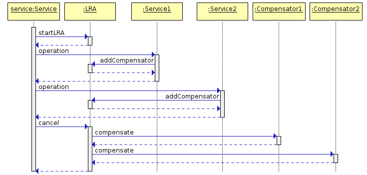

Table of Contents
=================

  - [Long Running Actions](#long-running-actions)
    - [Introduction](#introduction)
    - [Motivation](#motivation)
    - [Proposed solution](#proposed-solution)
      - [The Model](#the-model)
      - [CDI Annotations for LRAs](#cdi-annotations-for-lras)
        - [Java Annotations](#java-annotations)
          - [Controlling the lifecycle of an LRA](#controlling-the-lifecycle-of-an-lra)
          - [Compensating Activities](#compensating-activities)
          - [Nesting LRAs](#nesting-lras)
          - [Timing out LRAs and Compensators](#timing-out-lras-and-compensators)
          - [Leaving an LRA](#leaving-an-lra)
          - [Reporting the status of a compensator](#reporting-the-status-of-a-compensator)
          - [Forgetting an LRA](#forgetting-an-lra)
          - [Injecting an LRA Client API](#injecting-an-lra-client-api)
      - [Java based compensation registration API](#java-based-compensation-registration-api)
      - [Interoperability with other languages](#interoperability-with-other-languages)
        - [Protocol URLs](#protocol-urls)
          - [LRA Coordinator URL](#lra-coordinator-url)
          - [The LRA URL](#the-lra-url)
          - [Compensators](#compensators)
  - [Short Running Actions](#short-running-actions)
    - [Architecture](#architecture)
    - [State Transitions](#state-transitions)
    - [Transaction Context Propagation](#transaction-context-propagation)
    - [CDI Annotations for SRAs](#cdi-annotations-for-sras)
      - [SRA Lifecycle Support](#sra-lifecycle-support)
      - [SRA Participant Support](#sra-participant-support)
        - [Rollback](#rollback)
        - [Commit](#commit)
        - [OnePhaseCommit](#onephasecommit)
        - [Prepare](#prepare)
        - [Status](#status)
      - [Timing out SRAs and Participants](#timing-out-sras-and-participants)
        - [TimeLimit](#timelimit)
      - [Java based participant registration API](#java-based-participant-registration-api)

# Long Running Actions

* Proposal: [MP-0009](0009-LRA.md)
* Authors: [Michael Musgrove](https://github.com/mmusgrov/)
* Status: **Sandbox**

* Decision Notes: [Discussion thread topic covering the  Rationale](https://groups.google.com/forum/#!searchin/microprofile/transactions%7Csort:relevance/microprofile/CJirjFkM9Do/TrApz-fBDQAJ)

## Introduction

The proposal introduces an API for loosely coupled services to coordinate long running activities in such a way as to guarantee a globally consistent outcome without the need to take locks on data.

The API is framed in terms of Java CDI annotations that should be applied to JAX-RS resources. However, the proposal is also described in terms of REST resources which means that services written in other languages can also coordinate with CDI annotated JAX-RS resources. And for services that do not communicate vai HTTP we also define a pure java based registration API.

## Motivation

In a loosely coupled service based environment there is sometimes a need for different services to provide consistency guarantees. Typical examples include:

* order processing involving three services (take order, bill customer, ship product). If the shipping service finds that it is out of stock then the customer will have been billed with no prospect of receiving his item;
* an airline overbooks a flight which means that the booking count and the flight capacity are inconsistent.

There are various ways that systems overcome such inconsistency but it would be advantageous to provide a generic solution which handles failure conditions, maintains state for those flows that span long periods of time and ensures that correcting activities are called correctly.

Traditional techniques for guaranteeing consistency in distributed environments has focused on XA transactions where locks may be held for long periods thereby introducing strong coupling between services and decreasing concurrency to unacceptable levels. Additionally, if such a transaction aborts then valuable work which may be valid will be rolled back. In view of these issues an alternative approach is desirable.

Goals

- support long running actions
- no strong coupling between services
- allow actions to finish early
- allow compensating actions if a business activity is cancelled

## Proposed solution

We propose a compensation based approach in which participants (or compensators) make changes visible but register a compensatory action which is performed if something goes wrong. We call the model LRA (short for Long Running Action) and is based on an work done within the [OASIS Web Services Composite Application Framework Technical Committee](https://www.oasis-open.org/committees/tc_home.php?wg_abbrev=ws-caf): [Long Running Action transaction model](https://www.oasis-open.org/committees/document.php?document_id=12794) but updated to be more suited for use in microservice based architectures.
 
Within the LRA model, an activity reflects business interactions: all work performed within the scope of an activity is required to be compensatable. Therefore, an activity’s work is either performed successfully or undone. How services perform their work and ensure it can be undone if compensation is required are implementation choices and is not exposed to the LRA model which simply defines the triggers for compensation actions and the conditions under which those triggers are executed. In other words, a LRA coordinator is concerned only with ensuring compensators obey the protocol necessary to make an activity compensatable (and the semantics of the business interactions are not part of the model). Issues such as isolation of services between potentially conflicting activities and durability of service work are assumed to be implementation decisions. The coordination protocol used to ensure an activity is completed successfully or compensated is not two-phase and is intended to better model interactions between microservices. Although this may result in non-atomic behaviour for the overall business activity, other activities may be started by the service to attempt to compensate in some other manner.
 
In the model a LRA is tied to the scope of an activity so that when the activity terminates the LRA coordination protocol will be automatically performed either to accept or to compensate the work. For example, when a user reserves a seat on a flight, the airline reservation centre may take an optimistic approach and actually book the seat and debit the users account, relying on the fact that most of their customers who reserve seats later book them; the compensation action for this activity would be to un-book the seat and credit the user’s account.
 
As in any business interaction, service activities may or may not be compensatable. Even the ability to compensate may be a transient capability of a service. A Compensator is the LRA participant that operates on behalf of a service to undo the work it performs within the scope of a LRA or to compensate for the fact that the original work could not be completed.


### The Model

The model concerns compensators and a coordinator. A client starts a new LRA via the LRA coordinator. When a service does work that may have to be later compensated within the scope of the LRA, it enlists a compensator with the LRA coordinator. Subsequently the client closes or cancels the LRA via the coordinator which in turn tells all enlisted compensators to either complete or compensate:

 The lifecycle of a LRA
 
The compensator will be invoked in the following way by the LRA coordinator when the activity terminates:
* Success: the activity has completed successfully. If the activity is nested then compensators may propagate themselves (or new compensators) to the enclosing LRA. Otherwise the compensators are informed that the activity has terminated and they can perform any necessary cleanups.
* Fail: the activity has completed unsuccessfully. All compensators that are registered with the LRA will be invoked to perform compensation in the reverse order. The coordinator forgets about all compensators that indicated they operated correctly. Otherwise, compensation may be attempted again (possibly after a period of time) or alternatively a compensation violation has occurred and must be logged.
Each service is required to log sufficient information in order to ensure (with best effort) that compensation is possible. Each compensator or subordinate coordinator (in the case of nested LRAs) is responsible for ensuring that sufficient data is made durable in order to undo the LRA in the event of failures. Interposition and check pointing of state allow the system to drive a consistent view of the outcome and recovery actions taken, but allowing always the possibility that recovery isn’t possible and must be logged or flagged for the administrator. In a large scale environment or in the presence of long term failures recovery may not be automatic and manual intervention may be necessary to restore an application’s consistency.
 
Different usage patterns for LRAs are possible, for example LRAs may be used sequentially and concurrently, where the termination of one LRA signals the start of some other unit of work within an application. However, LRAs are units of compensatable work and an application may have as many such units of work operating simultaneously as it needs to accomplish its tasks. Furthermore, the outcome of work within LRAs may determine how other LRAs are terminated. An application can be structured so that LRAs are used to assemble units of compensatable work and then held in the active state while the application performs other work in the scope of different (concurrent or sequential) LRAs. Only when the right subset of work (LRAs) is arrived at by the application will that subset be confirmed; all other LRAs will be told to cancel (complete in a failure state).

### CDI Annotations for LRAs

* Support for the proposal in MicroProfile is primarily based upon the use of CDI annotations for controlling the lifecycle of LRAs and Compensators (although the proposal
does permit an [injectable client API)](lra-annotations/src/main/java/org/eclipse/microprofile/lra/client/LRAClientAPI.java). The client API still requires that compensators listen on REST endpoints. This requirement is overly restrictive since not all applications communicate via HTTP so we also specify an optional registration API for compensators that avoids having to explicitly support HTTP. See the [section below](#Java-based-compensation-registration-API) for a description of this API.
* [Source code for the proposed annotations:](lra-annotations/src/main/java/org/eclipse/microprofile/lra/annotation). 
* [Java based compensation registration API](#java-based-compensation-registration-api)

#### Java Annotations
 
A JAX-RS implementation of the specification should be achievable via a set of CDI annotations. The service developer annotates resources to specify how LRAs should be controlled:
 
##### Controlling the lifecycle of an LRA
 
@LRA - the Type element of the LRA annotation indicates whether a bean method is to be executed within a compensatable transaction context. Supported types are:
 
* REQUIRED: a new LRA is started if none is present and ended when the method finishes
* REQUIRES_NEW: if there is already an LRA it is suspended and a new one is started. When the method finishes any preexisting LRA is resumed, otherwise the new one is ended.
* MANDATORY: if there is no LRA present the method is not called and a PRECONDITION_FAILED status code is generated
* SUPPORTS: if there is already an LRA present the bean method will be called with it as the LRA context
* NOT_SUPPORTED: if there is already an LRA it is suspended (and resumed after the method finishes)
* NEVER: if there is already an LRA present the method is not called and a PRECONDITION_FAILED status code is generated
 
The bean writer can also specify which http status codes returned by a bean method will cancel the LRA using the cancelOn or cancelOnFamily type elements which are arrays of HTTP status codes or status families, respectively.
 
If an annotation causes an LRA to be started it will be ended when the bean method finishes. This behaviour can be overridden by setting the delayClose element to true.
 
If there is an LRA present when a bean method is invoked it will still be active when the method finishes. This behaviour can be overridden by setting the terminal element to true.
 
When an LRA is present it should be made available to the business logic via request and response headers (with the name "X-lra")
 
Example:
 
```java
  @POST
  @Path("/book")
  @Produces(MediaType.APPLICATION_JSON)
  @LRA(
              value = LRA.Type.REQUIRED,
              cancelOn = {Response.Status.INTERNAL_SERVER_ERROR} // cancel on a 500 code
              cancelOnFamily = {Response.Status.Family.CLIENT_ERROR}, // cancel on any 4xx code
              delayClose = true) // delayClose because we want the LRA to be associated with a booking until the user confirms the booking
  public Response bookTrip(...) { ... }
 
  @PUT
  @Path("/complete")
  @Produces(MediaType.APPLICATION_JSON)
  @Consumes(MediaType.APPLICATION_JSON)
  @LRA(
               LRA.Type.SUPPORTS,
               terminal = true) // the confirmation should trigger the closing of the LRA started in the bookTrip bean method
  public Booking confirmTrip(Booking booking) throws BookingException { ... }
```
 
##### Compensating Activities
 
Compensators join LRAs using the @LRACompensatorCompensate and @LRACompensatorComplete annotations. When a bean method executes in the context of an LRA any methods
in the bean class that are annotated with @LRACompensatorCompensate, @LRACompensatorComplete and @LRACompensatorStatus will be used to as the compensator and all three must be present.
If an annotation is present on multiple methods an arbitrary one is chosen. When the LRA is closed the method annotated with @LRACompensatorComplete will be invoked.
Similarly the @LRACompensatorCompensate method will be invoked if the LRA is cancelled. If it is unable to compensate then it must remember the fact until told to forget by providing a method annotated with an @Forget annotation. For example
 
```java
  @POST
  @Path("/compensate")
  @Produces(MediaType.APPLICATION_JSON)
  @LRACompensatorCompensate
  public Response compensateWork(@HeaderParam("X-lra") String lraId) {
    // compensate for whatever activity the business logic has associated with lraId
  }
```
 
##### Nesting LRAs
 
An activity can be scoped within an existing LRA using the @NestedLRA annotation. Invoking a method marked with this annotation will start a new LRA whose outcome
depends upon whether the enclosing LRA is closed or cancelled. If the nested LRA is closed but the outer LRA is cancelled then the compensators registered with the
nested LRA will be told to compensate. In the PoC there is no annotation to cancel a closed nested LRA so the demo uses an @Injected LRAClient bean (which encapsulates
the spec API) to cancel the nested LRA (which then triggers the compensator that was registered with the @NestedLRA annotation).
 
##### Timing out LRAs and Compensators
 
The ability to compensate may be a transient capability of a service so compensators (and LRAs) can be timed out after which the compensate is called (or LRA cancelled).
To set such a time limit use the @LRATimeLimit annotation, for example:
 
```java
  @GET
  @Path("/doitASAP")
  @Produces(MediaType.APPLICATION_JSON)
  @LRATimeLimit(limit = 100, unit = TimeUnit.MILLISECONDS)
  @LRA(value = LRA.Type.REQUIRED)
  public Response theClockIsTicking(@HeaderParam(LRA_HTTP_HEADER) String lraId) {...}
```
 
##### Leaving an LRA
 
If a bean method annotated with @LRACompensatorLeave is annotated in the context of a LRA then if the bean class has registered a compensator with the active
LRA it will be removed from the LRA (will not be asked to complete or compensate when the LRA is ended).
 
##### Reporting the status of a compensator
 
Compensators must provide a method for reporting the status of the compensator by annotating one of the methods with the @LRACompensatorStatus annotation.
 
It is the responsibility of the service writer to return (as a String) a valid status value from the enum:
 
```java
/**
 * The status of a compensator. The status is only valid after the coordinator has told the compensator to
 * complete or compensate. The name value of the enum should be returned by compensator methods marked with
 * the {@link LRACompensatorStatus} annotation.
 */
public enum CompensatorStatus {
    Compensating, // the Compensator is currently compensating for the LRA.
    Compensated, //  the Compensator has successfully compensated for the LRA.
    FailedToCompensate, //  the Compensator was not able to compensate for the LRA
                // (and must remember it could not compensate until it receives a forget message).
    Completing, //  the Compensator is tidying up after being told to complete.
    Completed, //  the Compensator has confirmed.
    FailedToComplete, //  the Compensator was unable to tidy-up.
}
```
 
If the compensator is in none of these states it should report the error using a BAD_REQUEST HTTP status code.

##### Forgetting an LRA

If a compensator is unable to compensate then it must remember the fact until explicitly told that it can clean up using the @Forget annotation.

##### Injecting an LRA Client API

For completeness the proposal supports clients that wish to directly control LRAs and compensators. To support this class of user an instance of
[client API](lra-annotations/src/main/java/org/eclipse/microprofile/lra/client/LRAClientAPI.java) can be injected.

### Java based compensation registration API

If an application cannot directly expose JAX-RS endpoints for compensation activities the framework (ie the code that implements this specification) optionally supports a registration for this purpose:

``` java
/**
 * The API for notifying compensators that an LRA is completing or cancelling
 */
public interface LRACompensator {
    void completeWork(String lraId) throws NotFoundException;

    void compensateWork(String lraId) throws NotFoundException;

    void forgetWork(String lraId) throws NotFoundException;

    CompensatorStatus status(String lraId) throws NotFoundException;
}
```

where the possible values for the status of a compensator is captured in the following definition:

``` java
/**
 * The status of a compensator. The status is only valid after the coordinator has told the compensator to
 * complete or compensate. The name value of the enum should be returned by compensator methods marked with
 * the {@link Status} annotation.
 */
public enum CompensatorStatus {
    Compensating, // the Compensator is currently compensating for the LRA.
    Compensated, //  the Compensator has successfully compensated for the LRA.
    FailedToCompensate, //  the Compensator was not able to compensate for the LRA (and must remember it could not compensate until it receives a forget message).
    Completing, //  the Compensator is tidying up after being told to complete.
    Completed, //  the Compensator has confirmed.
    FailedToComplete, //  the Compensator was unable to tidy-up.
}
```

The compensator is registered as follows:

``` java
public interface LRAManagement {
    /**
     * join an LRA
     * @param compensator an instance of a {@link Compensator} that will be notified when the target LRA ends
     * @param deserializer a mechanism for recreating compensators during recovery
     * @param lraId the LRA to join
     */
    void joinLRA(Compensator compensator, CompensatorDeserializer deserializer, String lraId);
}
```

How the application obtains an LRAManagement instance is unspecified. The deserializer matches the interface

``` java
/**
 * An object that knows how to recreate a compensator from its' persistent form
 */
public interface CompensatorDeserializer {
    Compensator deserialize(ObjectInputStream objectInputStream);
    Compensator recreate(byte[] recoveryState);
}
```

Compensators must be serializable for this approach to work.

The purpose of the deserializer covers recovery scenarios (where one or more components fail): the framework must guarantee that compensators will still be triggered (the LRA protocol still provides the "all or nothing" guarantees that traditional transactions give). The deserializer provides a mechanism for the recovery component to recreate compensators from their persistent form. Note that, in contrast to the CDI based support, an installation must ensure that the java class definitions of Compensators must be made available to the recovery system. Serializable compensators need to know how to contact the original business application in order to trigger compensation activities whereas the CDI based solution need only persist resource paths which are likely to correspond to existing microservice endpoints. In other words, from an administrative and manageability point of view, it is desirable to use the [CDI Annotations for LRAs] (#CDI-Annotations-for-LRAs).

### Interoperability with other languages

To support coordination with services that do not support CDI there follows a specification of how to drive the protocol using HTTP resource URLs:

#### Protocol URLs

##### LRA Coordinator URL

The path or stem of a LRA coordinator URL is \<base uri\>/lra-coordinator where base-uri is \<protocol\>://\<hostname\> (such as http://localhost:8080).
 
* Performing a GET on \<base uri\>/lra-coordinator returns a list of all LRAs.
* Performing a GET on \<base uri\>/lra-coordinator/recovery returns a list of recovering LRAs.
* Performing a GET on \<base uri\>/lra-coordinator/active returns a list of inflight LRAs.
* Performing a DELETE on any of the lra-coordinator URLs will return a 401.

The status of each returned LRA is <a name="status-format">reported in JSON format</a>:

``` json

    "LRAStatus": {
      "type": "object",
      "properties": {
        "lraId": {
          "type": "string"
        },
        "clientId": {
          "type": "string"
        },
        "httpStatus": {
          "type": "integer",
          "format": "int32"
        },
        "responseData": {
          "type": "array",
          "items": {
            "type": "string"
          }
        },
        "recovering": {
          "type": "boolean",
          "default": false
        },
        "topLevel": {
          "type": "boolean",
          "default": false
        },
        "compensated": {
          "type": "boolean",
          "default": false
        },
        "encodedResponseData": {
          "type": "string"
        },
        "complete": {
          "type": "boolean",
          "default": false
        },
        "active": {
          "type": "boolean",
          "default": false
        }
      }
    }
```

##### The LRA URL
 
Each client is expected to have a unique identity which we'll call ClientID (it can be a URL too).
 
Performing a POST on \<base uri\>/lra-coordinator/start?ClientID=\<ClientID\> will start a new LRA with a default timeout and return a LRA URL that uniquely identifies the new LRA. An obvious choice for the URL format could be \<base uri\>/lra-coordinator/\<LRAId\>). An better alternative would be to allow the coordinator to return any URL format - ie instead of the URLs in points 2-6 the coordinator would return a [link header](https://tools.ietf.org/html/rfc5988) instead. Adding a query parameter, TimeLimit=\<timeout\>, will start a new LRA with the specified timeout (in milliseconds). If the LRA is terminated because of a timeout then the LRA will be cancelled. Adding a query parameter, ParentLRA=\<parent LRA URL\>, will nest the new LRA under the parent LRA which means that closing/cancelling the parent will automatically close/cancel the new LRA.
<a name="proposed-change"></a>
1. Performing a GET on \<base uri\>/lra-coordinator/\<LRAId\> returns 200 if the LRA is still known to exist in which case the body contains a [JSON representation of its current status](#status-format). A 404 response means it is not present.
2. Performing a GET on \<base uri\>/lra-coordinator/\<LRAId\>/completed returns 200 if the LRA completed successfully (a 404 response means it is not present).
3. Performing a GET on \<base uri\>/lra-coordinator/\<LRAId\>/compensated returns 200 if the LRA compensated (a 404 response means it is not present).
4. Performing a PUT on \<base uri\>/lra-coordinator/\<LRAId\>/close will trigger the successful completion of the LRA and all compensators will be dropped by the coordinator (the complete message will be sent to each compensator). Upon termination, the URL is implicitly deleted. If it no longer exists, then 404 will be returned. The caller cannot know for sure whether the LRA completed or compensated without enlisting a compensator. The response body of the request may contain a JSON array of application specific strings (one for each compensator).
5. Performing a PUT on \<base uri\>/lra-coordinator/\<LRAId\>/cancel will trigger the unsuccessful completion of the LRA and all compensators will be notified by the coordinator (the compensate message will be sent to each compensator). The response body of the request may contain a JSON array of application specific strings (one for each compensator).
6. Performing a PUT on \<base uri\>/lra-coordinator/\<LRAId\>/renew along with a query parameter, TimeLimit=\<timeout\>, will update the timeout, in milliseconds, for the LRA starting from the time the PUT request was acted upon.
 
Once the LRA terminates the implementation may retain information about it for an indeterminate amount of time.

##### Compensators
 
When making an invocation on a resource that needs to participate in a LRA, the LRA context (the LRA URL) needs to be transmitted to the resource. How this happens is outside the scope of this effort. It may occur as additional payload on the initial request such as in an HTTP header, or it may be that the client sends the context out-of-band to the resource. *To facilitate interoperability between different implementations of this specification we recommend that the context is passed using an HTTP header with name the name "X-lra"*
 
Once a resource has the LRA context, it can register participation in the LRA (ie enlist the compensator). The compensator is free to use whatever URL structure it desires for uniquely identifying itself with the constraint that it must be unique for the LRA (ie the same compensator cannot be involved in more than one LRA). The \<compensator URL\> must support the following operations:
 
1. Performing a GET on the compensator URL will return the current status of the compensator, or 404 if the compensator is no longer present or 412 if the compensator has not yet been asked to compete or compensate. The following types are returned by compensators to indicate their current status:
Compensating: the compensator is currently compensating for the LRA.
Compensated: the compensator has successfully compensated for the LRA.
FailedToCompensate: the compensator was not able to compensate for the LRA. It must maintain information about the work it was to compensate until the coordinator sends it a forget message.
Completing: the compensator is tidying up after being told to complete.
Completed: the compensator has confirmed.
FailedToComplete: the compensator was unable to tidy-up.
The compensator registers with a LRA by performing a PUT on the LRA URL with a body that contains the \<compensator URL\>. The PUT request returns a unique handle/resource reference (aka RecoveryCoordinator) so that it can be uniquely reasoned about later:
 
      \<base uri\>/lra-recovery-coordinator/\<RecCoordId\>
 
2. Performing a GET on this URL will return the original \<compensator URL\>.
3. Performing a PUT on this URL will overwrite the old \<compensator URL\> with the new one supplied.
4. Performing a DELETE or POST will return a 401.
5. Performing a POST on \<compensator URL\>/compensate will cause the compensator to compensate the work that was done within the scope of the transaction. Performing a GET or PUT on this url will return 400. The compensator can optionally return an application specific string which will ultimately be made available to whoever closed or cancelled the LRA.
6. A compensator can be told to complete or compensate (by POSTing to the <compensator URL\>/complete and <compensator URL\>/compensate URLs, respectively). The compensator should return 200 OK unless it cannot satisfy the request immediately in which case it should return 202 Accepted. The compensator reports its' status by providing a status URL in the HTTP Location header field of the response. Performing a GET request on this status URL should return the [status as described above](#compensators). Optionally, the compensator can return an arbitrary string in the body and if it does so then the content will be made available to whoever closed/cancelled the LRA in the form of a JSON array (one for each compensator that enlisted in the LRA). If the compensator is unknown then 410 Gone will be returned and it can be assumed by the coordinator that the service compensated. Note that if a compensator cannot compensate it must maintain this information until it is told to forget via a POST request to \<compensator URL\>/forget. If a compendator cannot compensate or complete the fact should be handled by the application or logged if not.

A compensator can resign from a LRA at any time prior to the completion of an activity by performing a PUT on \<base uri\>/lra-coordinator/\<LRAId\>/remove with the URL of the compensator in the body of the request.
 
When a compensator is enrolled within a LRA, the entity performing the enrol can supply a number of qualifiers which may be used by the coordinator and business application to influence the overall outcome of the activity. The currently supported qualifiers are:

* TimeLimit: the time limit (in milliseconds, although the java annotation based support makes the unit configurable) that the compensator can guarantee that it can compensate the work performed by the service. After this time period has elapsed, it may no longer be possible to undo the work within the scope of this (or any enclosing) LRA and the compensate URL will be invoked. It may therefore be necessary for the application or service to start other activities to explicitly try to compensate this work. The application or coordinator may use this information to control the lifecycle of a LRA.

# Short Running Actions

There are at least two important use cases that call for traditional ACID transactions:

1. the standard use case for Sagas is to implement the individual steps in the Saga in the context of a traditional two phase transaction;
2. in situations where repeatedly retrying compensatory actions is not a good solution, such as where coordination of an outcome across a number of endpoints (resources) has to be atomic.

Case 1 can be supported using the standard JTA 1.2 CDI annotations. For case 2 we propose a REST based protocol (with both CDI and Java APIs) for managing the transaction context which is hereafter referred to as the SRA context (note that this blocking protocol should only be used by services that can tolerate the stronger coupling that a two phase protocol demands). 

## Architecture

[The protocol documentation](http://narayana.io//docs/specs/restat-v2-draft-8-2013-jul-29.pdf) describes the approach in detail. In this proposal we restrict ourselves to:

- summarising the main features;
- defining a set of CDI annotations for use with JAX-RS resources;
- providing a Java API (for non CDI aware services)

and refer the reader (ie specification implementer) to the original specification for further details.

The model includes the following actors:

* SRA Manager: a factory resource responsible for creating new short running actions (after which it has no further role to play in the lifespan of the SRA).
* SRA Coordinator: a resource representation of a SRA (responsible for driving the two-phase commit protocol and managing interactions with participants).
* Client: the user of a SRA (normally a service).
* Service: a SRA-aware participant that performs work that may need to be coordinated with other similar services elsewhere.
* Participant: a resource that manages the state changes performed by the service in the context of a SRA (it is driven through two-phase commit by the coordinator).

In the following the terms transaction, transaction coordinator and short running action (SRA) are often used interchangeably but the new term SRA is preferred. If we want to refer to a JTA transaction then we will always use the JTA prefix.

 Protocol Actors: clients, services, participants, transaction coordinators (SRA) and factory (TM).

## State Transitions

A SRA and two-phase participant go through the state transitions shown below:

 Coordinator and participant state transitions.

Asking a resource to change its state from, say, Active to Committed, may drive it through all of the intermediate states and as a result trigger protocol specific events. States are reported using media types application/txstatus (or application/txstatusext+xml for additional status information such as the time the SRA was created, the number of participants within the SRA etc).

A SRA is created by POSTing to the SRA manager URL which returns a URL for the new SRA in the location header and at least two URLs in a link header that clients and services may use to terminate (sra-terminator URL) and join (the sra-enlistment URL) the SRA.

## Transaction Context Propagation

When services interact the receiving service may need to join the SRA and to do that it needs the enlistment URL. How it obtains the enlistment URL is unspecified but, for the purposes of interoperability, we recommend that it is propagated via an HTTP header with the name "X-sra". Once the receiving service has the url it issues a PUT request and includes a link header that contains the prepare, commit, rollback and optionally commit-one-phase URLs that the coordinator will subsequently use to drive the participant to completion.

## CDI Annotations for SRAs
lra-annotations/src/main/java/org/eclipse/microprofile/lra/annotation

* Support for the proposal in MicroProfile is primarily based upon the use of [CDI annotations](sra-annotations/src/main/java/org/eclipse/microprofile/sra/annotation) for controlling the lifecycle of SRAs and Participants. We do also specify an [injectable client API (TODO git push the API classes)](sra-annotations/src/main/java/org/eclipse/microprofile/sra/client/SRAClientAPI.java) for non CDI based services that do support REST endpoints. And for services that support neither (CDI and REST endpoints) we also specify a Java registration API, see the [section below](#Java-based-participant-registration-API) for a description of this API.

### SRA Lifecycle Support

The lifecycle of a SRA is controlled using an annotation called SRA which is broadly similar to the standard JTA 1.2 javax.transaction.Transactional annotation. The reason for introducing a new annotation type is threefold:

1. to support JAX-RS status codes for handling error conditions;
2. to document the fact that the annotation concerns SRAs rather than JTA transactions;
3. to support (inbound) bridging to a local JTA transaction.

``` java
/**
 * An annotation for controlling the lifecycle of Short Running Actions (SRAs).
 *
 * Newly created SRAs are uniquely identified and the id is referred to as the SRA context. The context
 * is passed around using a JAX-RS request/response header called SRAClient#SRA_HTTP_HEADER ("X-sra").
 * The implementation (of the SRA specification) is expected to manage this context and the application
 * developer is expected to declaratively control the creation, propagation and destruction of SRAs
 * using this @SRA annotation. When a JAX-RS bean method is invoked in the context of an SRA any JAX-RS
 * client requests that it performs will carry the same header so that the receiving resource knows that
 * it is inside an SRA context (typically achieved using JAX-RS client filters). Similarly if the
 * {@link SRA#enableJTABridge()} attribute is enabled then a JTA transaction context will be associated
 * for the duration of the method call so that any resources used by the method will be enlisted with
 * the SRA and will be committed or rolled back when the SRA finishes.
 *
 * Resource methods can access the context id, if required, by injecting it via the JAX-RS @HeaderParam
 * annotation or via the {@link sra.service.SRAClient} API. This may be useful, for example, for associating
 * business work with an SRA.
 */
@Inherited
@InterceptorBinding
@Retention(value = RetentionPolicy.RUNTIME)
@Target({ElementType.TYPE, ElementType.METHOD})
public @interface SRA {

    /**
     * The Type element of the SRA annotation indicates whether a bean method
     * is to be executed within the context of a SRA.
     */
    Type value() default Type.REQUIRED;

    enum Type {
        /**
         *  If called outside a SRA context a JAX-RS filter will begin a new SRA for the duration of
         *  the method call and when the call completes another JAX-RS filter will complete the SRA.
         */
        REQUIRED,

        /**
         *  If called outside a SRA context a JAX-RS filter will begin a new SRA for the duration of
         *  the method call and when the call completes another JAX-RS filter will complete the SRA.
         *
         *  If called inside a SRA context a JAX-RS filter will suspend it and begin a new SRA for
         *  the duration of the method call and when the call completes another JAX-RS filter will
         *  complete the SRA and resume the one that was active on entry to the method.
         */
        REQUIRES_NEW,

        /**
         *  If called outside a SRA context, the method call will return with a 412 Precondition
         *  Failed HTTP status code
         *  If called inside a SRA context the bean method execution will then continue under
         *  that context.
         */
        MANDATORY,

        /**
         *  If called outside a SRA context managed bean method execution
         *  must then continue outside a SRA context.
         *  If called inside a SRA context, the managed bean method execution
         *  must then continue inside this SRA context.
         */
        SUPPORTS,

        /**
         *  The bean method is executed without a SRA context. If a context is present on entry then
         *  it is suspended and then resumed after the execution has completed.
         */
        NOT_SUPPORTED,

        /**
         *  If called outside a SRA context, managed bean method execution
         *  must then continue outside a SRA context.
         *  If called inside a SRA context the method is not executed and a 412 Precondition Failed
         *  HTTP status code is returned to the caller.
         */
        NEVER
    }

    /**
     * Create a local JTA transaction context such that existing transactional JavaEE code may be
     * called within the scope of the SRA. This enables JTA resources to participate in the SRA
     * and will be committed or rolled back when the SRA finishes.
     *
     * @return whether or not JTA bridging is enabled
     */
    boolean enableJTABridge() default false;

    /**
     * Some annotations (such as REQUIRES_NEW) will start an SRA on entry to a method and
     * end it on exit. For some business activities it is desirable for the action to survive
     * method execution and be completed elsewhere.
     *
     * @return whether or not newly created SRAs will survive after the method has executed.
     */
    boolean delayCommit() default false;

    /**
     * Normally if an SRA is present when a bean method is invoked it will not be ended when the
     * method returns. To override this behaviour use the terminal element to force its termination
     *
     * @return true if an SRA that was present before method execution will be terminated when the
     * bean method finishes.
     */
    boolean terminal() default false;

    /**
     * The cancelOnFamily element can be set to indicate which families of HTTP response codes will
     * cause the SRA to cancel. By default client errors (4xx codes) and server errors (5xx codes)
     * will result in cancellation of the SRA.
     *
     * @return the {@link Response.Status.Family} families that will cause cancellation of the SRA
     */
    @Nonbinding
    Response.Status.Family[] cancelOnFamily() default {
        Response.Status.Family.CLIENT_ERROR, Response.Status.Family.SERVER_ERROR
    };

    /**
     * The cancelOn element can be set to indicate which  HTTP response codes will cause the SRA
     * to cancel
     *
     * @return the {@link Response.Status} HTTP status codes that will cause cancellation of the SRA
     */
    @Nonbinding
    Response.Status [] cancelOn() default {};
}
```

### SRA Participant Support

JAX-RS resources can participate in SRAs by indicating which methods should be called when the SRA is finishing:

#### Rollback

``` java
/**
 * When a SRA rolls back any bean resource classes that were invoked in its context will be notified
 * by calling methods marked with this SRARollback annotation. If a resource class contains multiple
 * Rollback annotations an arbitrary one is chosen.
 *
 * The annotation can be combined with {@link SRATimeLimit} annotation to limit the time that the
 * participant remains valid, after which this @SRARollback annotated method will be called.
 */
@InterceptorBinding
@Retention(RetentionPolicy.RUNTIME)
@Target({ElementType.METHOD})
public @interface SRARollback {
}
```

#### Commit

``` java
/**
 * When a SRA has prepared successfully any bean resource classes that were invoked in its context
 * will be notified by calling methods marked with the @SRACommit annotation. If a resource class
 * contains multiple SRACommit annotations an arbitrary one is chosen.
 */
@InterceptorBinding
@Retention(RetentionPolicy.RUNTIME)
@Target({ElementType.METHOD})
public @interface SRACommit {
}
```

#### OnePhaseCommit

``` java
/**
 * If a bean class contains a method marked with this annotation is invoked in the context of an
 * SRA that only contains a single participant then the annotated method will be invoked when the
 * SRA is asked to commit.
 * 
 * If a resource class contains multiple SRAOnePhaseCommit annotations an arbitrary one is chosen.
 */
@InterceptorBinding
@Retention(RetentionPolicy.RUNTIME)
@Target({ElementType.METHOD})
public @interface SRAOnePhaseCommit {
}
```

#### Prepare

``` java
/**
 * When a SRA is asked to commit any bean resource classes that were invoked in its context will
 * be notified by calling methods marked with the @SRAPrepare annotation. If a resource class
 * contains multiple Prepare annotations an arbitrary one is chosen.
 *
 * If the participant prepares successfully it must return a 200 code. If it cannot then it must
 * return a 409 code. Any response other than 200 MUST cause the SRA to roll back.
 */
@InterceptorBinding
@Retention(RetentionPolicy.RUNTIME)
@Target({ElementType.METHOD})
public @interface SRAPrepare {
}
```

#### Status

``` java
/**
 * In order to support recovery, participants must be able to report their status once the completion
 * part of the protocol starts.
 *
 * Methods annotated with this annotation must be JAX-RS resources and respond to GET requests
 * (ie are annotated with @Path and @GET, respectively). They must report their status using one
 * of the enum names listed in {@link sra.service.ParticipantStatus} whenever an HTTP GET request
 * is made on the method.
 */
@InterceptorBinding
@Retention(RetentionPolicy.RUNTIME)
@Target({ElementType.METHOD})
public @interface SRAStatus {
}
```

### Timing out SRAs and Participants

#### TimeLimit

``` java
/**
 * Used on {@link SRA} and {@link SRARollback} annotations to indicate the maximum time that the SRA or
 * participant should remain active for.
 *
 * When applied at the class level the timeout applies to any method that starts an SRA
 * or causes a participant to be registered (ie when the bean class contains a Commit annotation).
 *
 * In the case of participants the corresponding method that is annotated with {@link SRARollback} will
 * be invoked when the time limit is reached.
 */
@InterceptorBinding
@Retention(RetentionPolicy.RUNTIME)
@Target({ElementType.METHOD, ElementType.TYPE})
public @interface SRATimeLimit {
    long limit() default 0;

    TimeUnit unit() default TimeUnit.MILLISECONDS;
}
```

### Java based participant registration API

For the benefit of applications that do not directly expose JAX-RS endpoints for participant activities the framework (ie the code that implements this specification) optionally supports a programatic registration API:

``` java
public interface SRAParticipant {

    Vote prepare() throws ParticipantException;

    void commit() throws ParticipantException, HeuristicException;

    void commitOnePhase() throws ParticipantException;

    void rollback() throws ParticipantException, HeuristicException;
}
```

The participant is registered as follows:

``` java
public interface SRAManagement {
    /**
     * join a SRA
     *
     * @param participant, an instance of a {@link Participant} that will be notified when the
     * target SRA ends
     * @param deserializer a mechanism for recreating compensators during recovery
     * @param sraId the SRA to join
     */
    void joinSRA(SRAParticipant participant, ParticipantDeserializer deserializer, String sraId);
}
```

How the application obtains an SRAManagement instance is unspecified. The deserializer matches the interface

``` java
/**
 * An object that knows how to recreate a participant from its' persistent form
 */
public interface ParticipantDeserializer {
    Participant deserialize(ObjectInputStream objectInputStream);
    Participant recreate(byte[] recoveryState);
}
```
